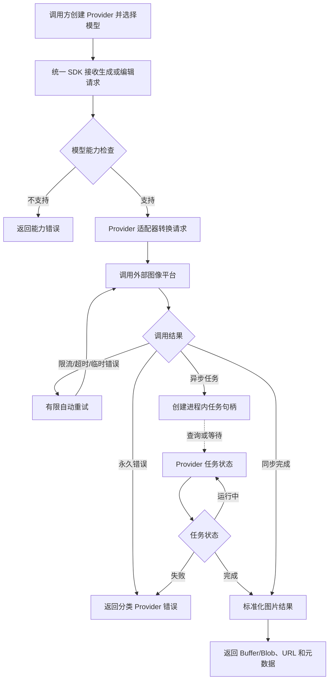
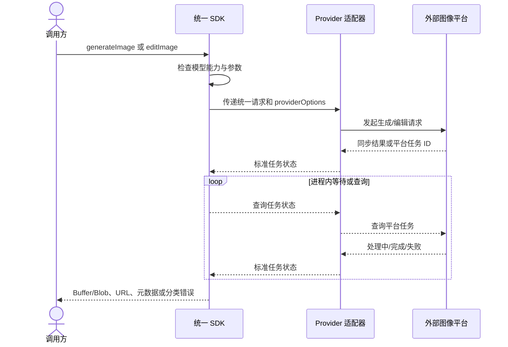
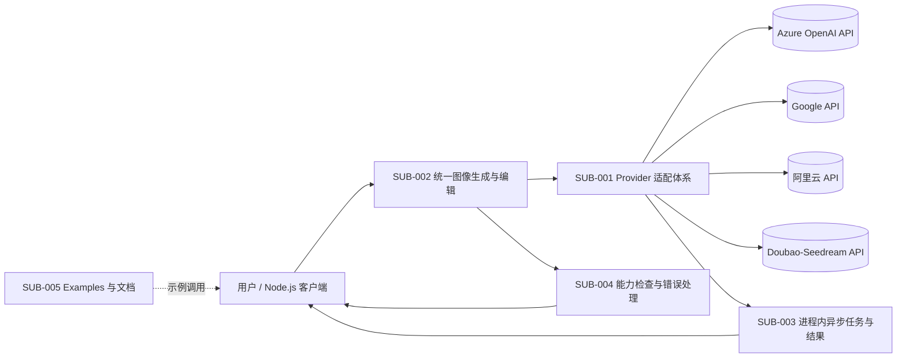

# 产品需求文档：AI Media SDK

## 0. 文档信息

- 产品名称：AI Media SDK
- 文档版本：v1.4.0
- 文档状态：草稿
- 创建日期：2026-07-30
- 最后更新：2026-07-30
- 结构模式：不使用 domain 层
- 产品定位：面向 Node.js 服务端应用的多 Provider 多模态生成 SDK；MVP 聚焦图像生成，核心类型模态无关并预留视频/音频生成扩展（P1/P2）
- 包 scope：`@ai-media/*`（核心包 `@ai-media/sdk`，Provider 包 `@ai-media/provider-<name>`，示例应用位于 `examples/*`）
- 仓库目录：当前工作目录仍为 `ai-img-sdk`，代码层 scope 以 `@ai-media/*` 为准；目录改名属可选后续动作，不影响实现

## 1. 产品背景

当前图像生成模型由多个平台分别提供，调用方式、认证方式、同步/异步流程、图片输入格式、输出格式、错误类型和模型参数存在差异。业务应用如果直接集成多个平台，通常需要在业务代码中编写 Provider 分支，导致以下问题：

- 更换模型平台时需要修改业务调用逻辑；
- 不同平台的异步任务处理方式难以统一；
- 图像 URL、二进制结果和 Provider 元数据的处理方式不一致；
- 平台独有能力与跨平台公共能力难以同时保留；
- 限流、超时、临时错误和能力不支持缺少统一的错误语义。

本产品提供一套独立于具体供应商的 TypeScript/JavaScript 多模态生成 SDK。MVP 首发聚焦图像生成（文生图与按能力开放的图片编辑），核心契约（Provider 工厂、模型实例、统一任务句柄、错误分类、有限重试、可注入 transport）按模态无关设计，后续可平滑接入视频生成与音频/音乐生成。产品保持类似 AI SDK 的开发体验，使用 Provider 工厂、模型实例和统一生成函数，但不直接把 AI SDK 作为核心运行时依赖。这样既保持产品自身的契约和演进能力，也降低多平台接入方的学习成本。

本项目当前仓库是 Next.js monorepo 起始模板，尚未存在 SDK 核心包或既有 PRD。当前 Web 应用不作为产品控制台，首期用于承载受控的 Web Playground；SDK Node.js 示例应用放在 `examples/*` 工作区，并为各 Provider 提供 `.env.example`。

## 2. 产品目标

### 2.1 主要目标

- 提供统一、类型安全的 Node.js 多模态生成调用体验；MVP 聚焦图像，核心类型模态无关并预留视频/音频扩展。
- 通过 Provider 工厂和模型实例支持 Azure OpenAI、Google、阿里云、字节 Doubao-Seedream 等平台。
- 统一文生图和按模型能力开放的图生图/图片编辑调用方式。
- 统一异步任务句柄、状态查询、等待完成和结果读取体验。
- 在保持公共接口简洁的同时，通过 `providerOptions` 暴露 Provider 独有能力。
- 通过能力检查和分类错误避免静默忽略不支持的参数。
- 让用户能够通过 examples 快速配置 API Key 并验证各 Provider。
- Provider 适配器统一通过可注入的 `transport`（fetch、超时、请求头）调用外部平台，**不包装官方 SDK**，保持零外部运行时依赖；Azure OpenAI 仅支持 API Key 鉴权（`api-key` 头）。
- 包结构按平台拆分独立 Provider 包（`@ai-media/provider-<name>`），用户按需安装；核心契约集中在 `@ai-media/sdk`。

### 2.2 成功标准

MVP 达成以下结果时视为达到产品目标：

- 用户可以使用同一套核心生成函数调用至少四类目标 Provider。
- 用户可以显式选择 Provider 和模型，而不需要在业务层编写平台分支。
- 对模型不支持的输入或参数，SDK 能在调用前或适配阶段返回稳定、可识别的能力错误。
- 对 Provider 的限流、超时和临时故障，SDK 能按统一规则分类并执行有限重试。
- 用户可以获得统一的图片结果、元数据和原始 Provider 关联信息。
- 每个首批 Provider 至少有可运行的 example、环境变量模板和基本用法说明。

### 2.3 非目标

以下内容不属于首期产品目标：

- 建设统一平台代理或服务端转发网关；
- 托管用户或 Provider API Key；
- 建设用户、团队、权限、账单或用量管理系统；
- 由 SDK 长期保存生成图片或提供对象存储；
- Webhook、跨进程任务持久化和 Redis/数据库任务存储；
- 自动在多个 Provider 之间进行 fallback 或智能路由；
- 建立统一模型别名并承诺跨平台语义完全一致；
- 首期支持浏览器端直接调用；
- 当前 Web 应用作为管理控制台、公共多租户平台或生产级在线服务。

## 3. 目标用户与角色

### 3.1 目标用户

| 用户角色 | 需求 | 首期价值 |
|---|---|---|
| Node.js 后端开发者 | 在服务端集成一个或多个图像模型 Provider | 通过统一 API 减少平台分支代码 |
| AI 应用开发者 | 快速切换模型、比较生成结果和保留平台能力 | 使用模型实例和 `providerOptions` 控制调用 |
| 产品原型开发者 | 通过少量配置验证多个图像平台 | 使用 `examples/*` 和 `.env.example` 快速运行 |
| SDK 维护者 | 扩展 Provider 且不破坏统一契约 | 使用清晰的 Provider 适配边界和能力声明 |

### 3.2 角色边界

- SDK 调用方负责 API Key、业务权限、结果长期存储和业务级重试策略。
- SDK 负责 Provider 请求适配、统一任务生命周期、结果标准化和可恢复错误处理。
- Provider 适配器不得替调用方决定业务模型、预算或跨 Provider 路由。

## 4. 核心业务流程

### 4.1 图像生成流程

**目的**：表达调用方从选择 Provider/模型到获得图片结果的主路径及错误分支。

**范围**：MVP 的文生图和按模型能力支持的图生图/图片编辑调用。

**参与者/图例**：调用方、统一 SDK、Provider 适配器、外部图像模型平台；实线表示同步调用，虚线表示轮询或异步状态获取。

**关键假设**：调用方已提供目标 Provider 的 API Key；具体模型能力由 Provider 能力声明决定。

ASCII 草图：

```text
[调用方]
    |
    | 创建 Provider / 选择模型 / 提交 prompt
    v
[统一 SDK] --> [能力检查]
    |              |
    |              +--> 不支持: 返回能力错误
    v
[Provider 适配器] --> [外部图像平台]
    |                         |
    |                         +--> 限流/超时/临时错误: 有限重试
    |                         |
    |                         +--> 永久错误: 返回分类错误
    v
[进程内任务句柄] --查询/等待--> [Provider 任务状态]
    |
    v
[统一图片结果: Buffer/Blob + URL + 元数据]
```

Mermaid：



**异常路径**：

- API Key 缺失或无效：返回认证错误，不重试。
- 参数或输入图片不符合模型要求：返回参数/能力错误，不重试。
- Provider 限流、网络暂时不可用或请求超时：按重试策略有限重试，耗尽后返回可识别错误。
- Provider 任务失败：保留任务标识和 Provider 错误上下文，但对外返回脱敏后的稳定错误。

**未覆盖范围**：Webhook、长期任务恢复、跨进程查询、自动切换 Provider、图片长期存储。

**相关需求**：`SUB-001`、`SUB-002`、`SUB-003`、`SUB-004`。

### 4.2 多参与者时序

**目的**：表达统一 SDK、Provider 适配器和外部平台之间的请求/响应关系。

**范围**：一次需要异步处理的图像生成或编辑请求。

**参与者/图例**：调用方、统一 SDK、Provider 适配器、外部平台；虚线表示状态查询。

**关键假设**：平台可能同步返回图片，也可能先返回平台任务 ID；SDK 在进程内维护任务句柄。

ASCII 草图：

```text
[调用方] -> [统一 SDK] -> [Provider 适配器] -> [外部平台]
   ^             |                                  |
   |             |<--------- 任务 ID ---------------|
   |             | - - - - 查询状态 - - - - - - - ->|
   |             |< - - - 完成/失败/处理中 - - - - -|
   |<------------ 标准化结果或分类错误 --------------|
```

Mermaid：



**异常路径**：查询超时、Provider 任务不存在、任务失败和重试耗尽均必须转换为稳定错误类型；不得把内部堆栈、令牌或完整敏感请求返回给调用方。

**未覆盖范围**：Provider Webhook、外部平台回调签名、服务端任务队列。

**相关需求**：`SUB-001`、`SUB-003`、`SUB-004`。

### 4.3 产品级模块架构

**目的**：表达 SDK 的需求分支、外部 Provider 和数据边界，不展开具体代码模块。

**范围**：产品级组件和依赖方向。

**参与者/图例**：用户/Node.js 客户端、产品模块（Sub）、外部系统、进程内任务状态；实线表示调用，虚线表示可选事件或元数据。

**关键假设**：SDK 不引入中心化服务；凭证由调用方传入并仅用于 Provider 请求。

ASCII 草图：

```text
[Node.js 调用方]
        |
        v
[统一生成/编辑 API] --> [能力检查与错误处理]
        |                         |
        v                         v
[Provider 适配体系] -------> [进程内任务句柄]
   |       |       |       |
   v       v       v       v
[Azure OpenAI] [Google] [阿里云] [Doubao-Seedream]
        |
        v
[统一结果: Buffer/Blob + URL + 元数据]
```

Mermaid：



**异常路径**：任一 Provider 失败不得直接泄漏平台响应中的敏感字段；统一层应保留可诊断的非敏感 Provider 标识、模型标识和错误类别。

**未覆盖范围**：数据库、对象存储、统一网关、管理控制台和账单系统。

**相关需求**：`SUB-001` 至 `SUB-005`。

## 5. 产品范围

### 5.1 产品包含

#### Provider 与模型

- Provider 工厂，用于绑定 API Key、基础配置和平台请求能力。
- 模型实例，用于显式指定 Provider 下的模型标识。
- 首批 Provider：Azure OpenAI、Google、阿里云、Doubao-Seedream。
- Azure OpenAI 首期优先支持 Azure 上部署的 OpenAI 图像模型；普通 OpenAI 公网直连不属于 MVP Provider。
- 首期锁定 Provider，不把模型名称和版本做成跨平台统一别名；但各 Provider 可以维护推荐模型目录，模型名由调用方显式传入或由 Provider 文档说明。
- Provider 应声明模型支持的生成、编辑、图片输入、尺寸、格式和任务能力。

阿里云百炼首期推荐模型目录（模型能力来自用户提供的百炼资料，具体 API 请求和认证仍由 Provider 技术方案确认）：

| 模型 ID | 文生图 | 图片编辑 | 最大输出数 | 最大分辨率 | 推荐场景 |
|---|---|---|---:|---|---|
| `wan2.7-image-pro` | 支持 | 支持 | 4（连续生成 12） | 文生图 4096x4096；编辑 2048x2048 | 高质量、文字渲染、品牌色、角色一致性、多图编辑 |
| `wan2.7-image` | 支持 | 支持 | 4（连续生成 12） | 2048x2048 | 平衡质量和速度 |
| `z-image-turbo` | 支持 | 不支持 | 1 | 2048x2048 | 快速、低成本、写实人像和产品照片 |
| `qwen-image-3.0-pro` | 支持 | 支持 | 6 | 2048x2048 | 复杂版面、小字渲染、多语言字体；邀测中 |
| `qwen-image-2.0-pro` | 支持 | 支持 | 6 | 2048x2048 | 高质量生成/编辑、负向提示词 |
| `qwen-image-2.0` | 支持 | 支持 | 6 | 2048x2048 | Qwen Image Pro 的快速版本 |

其他百炼模型（如 `wan2.6-*`、`wan2.5-*`、`wan2.2-*`、`wan2.1-*`、Qwen Image legacy/edit 变体）由模型能力注册表按需扩展，不作为首期推荐默认值。

#### 统一图像能力

- 文生图。
- 图生图/图片编辑，按具体模型能力开放。
- 图片输入至少考虑 `Buffer`、URL 和适合 Node.js 的二进制表示。
- 多图、mask、特殊参考图等输入不作为所有模型的统一保证；由模型能力声明或 Provider 原生参数决定。
- 公共参数与 `providerOptions` 并存。

#### 任务与结果

- 进程内任务句柄。
- 任务提交、状态查询和等待完成。
- 对平台异步任务进行统一状态映射。
- 统一返回图片结果、URL/二进制可读内容和元数据。
- 不负责长期保存或托管图片。

#### 错误与可靠性

- 认证、参数、能力、限流、超时、Provider、任务失败等分类错误。
- 仅对明确可恢复的限流、网络暂时故障和超时执行有限自动重试。
- 错误中保留非敏感的 Provider 和模型上下文。
- 不自动 fallback 到其他 Provider。

#### Examples 与文档

- 在 monorepo 的 `examples/*` 下提供可运行示例应用。
- 每个首批 Provider 提供 `.env.example`。
- 示例说明 API Key 配置、Provider 工厂、模型实例和统一生成调用。
- 当前 Web 应用提供受控 Web Playground，用于服务端保护密钥下的生成验证；不作为管理控制台或公共平台代理。
- 示例不应把真实密钥提交到仓库。

### 5.2 产品不包含

- Python、Java、Go 等非 TypeScript/JavaScript SDK。
- 浏览器端直接调用和客户端密钥保护方案。
- 统一云端 API、平台代理密钥、统一计费和用量统计。
- 用户/团队/权限管理。
- Webhook、消息队列和跨进程任务恢复。
- Redis、数据库或对象存储集成。
- 智能模型路由、价格/速度优化和自动 Provider fallback。
- 统一模型别名及跨平台完全一致的生成语义。
- 将 AI SDK 作为核心运行时依赖。

## 6-alt. 需求分支地图

本产品不使用 domain 层，采用 `sub → feat` 两级结构。总 PRD 只维护 Sub，不维护 Feat 列表；具体 Feat 由对应 sub 级 `prd.md` 维护。

| Sub ID | 分支名称 | 目录 | 目标与范围 | 与其他 Sub 的边界 | 优先级 |
|---|---|---|---|---|---|
| `SUB-001` | Provider 适配体系 | `sub-provider-adapters` | Provider 工厂、模型实例、凭证配置、平台请求适配和首批平台接入 | 不定义统一业务调用语义；由 `SUB-002` 消费适配能力 | P0 |
| `SUB-002` | 统一图像生成与编辑 | `sub-image-generation` | 文生图、图生图/图片编辑、公共参数、图片输入和 `providerOptions` | 不负责 Provider 认证细节和任务持久化 | P0 |
| `SUB-003` | 异步任务与结果契约 | `sub-task-result-contract` | 进程内任务句柄、状态、等待、结果格式、元数据 | 不负责外部队列、长期存储和 Webhook | P0 |
| `SUB-004` | 能力检查与错误处理 | `sub-capability-error-handling` | 能力声明、参数校验、错误分类、有限重试 | 不负责智能路由和业务级 fallback | P0 |
| `SUB-005` | SDK 体验与示例应用 | `sub-sdk-examples` | 包入口、类型导出、Node.js 示例、受控 Web Playground、环境模板和基础文档 | 不负责 Web 管理控制台和产品运营能力 | P1 |
| `SUB-006` | 视频生成（预留） | `sub-video-generation` | 视频生成调用入口与任务生命周期，复用核心契约（`TaskHandle<T>`/`GenerationResult<T>`） | MVP 不实现；P1 评估，依赖 Provider 视频能力与官方资料齐备 | P1 |
| `SUB-007` | 音频/音乐生成（预留） | `sub-audio-generation` | 语音合成与音乐生成调用入口，复用核心契约 | MVP 不实现；P1/P2 评估 | P1 |

## 7. 用户故事

| ID | 用户故事 | 验收关注点 | 对应 Sub |
|---|---|---|---|
| `US-001` | 作为 Node.js 开发者，我希望通过 Provider 工厂配置平台凭证，以便不用在业务代码中拼接平台请求。 | 能创建 Provider 并安全传递凭证；不要求中心化密钥服务。 | `SUB-001` |
| `US-002` | 作为 AI 应用开发者，我希望通过模型实例选择具体模型，以便明确控制生成目标。 | Provider 和模型显式可见；不依赖统一模型别名。 | `SUB-001`、`SUB-002` |
| `US-003` | 作为调用方，我希望用统一函数执行文生图，以便切换 Provider 时保留主要业务代码。 | 公共输入和结果契约稳定。 | `SUB-002` |
| `US-004` | 作为调用方，我希望按模型能力执行图生图或图片编辑，以便使用平台支持的高级能力。 | 不支持的能力显式报错，不静默忽略。 | `SUB-002`、`SUB-004` |
| `US-005` | 作为调用方，我希望通过 Buffer/Blob、URL 和元数据获取结果，以便接入不同的服务端图片处理流程。 | 结果格式统一，平台元数据可追溯。 | `SUB-003` |
| `US-006` | 作为调用方，我希望等待异步任务完成或查询任务状态，以便适配不同平台的处理时长。 | 任务句柄在当前进程内可查询和等待。 | `SUB-003` |
| `US-007` | 作为调用方，我希望错误区分认证、参数、能力、限流和 Provider 失败，以便决定是否修正请求或重试。 | 错误分类稳定且不泄漏敏感信息。 | `SUB-004` |
| `US-008` | 作为 SDK 维护者，我希望通过 Provider 独有参数扩展能力，以便不被跨平台最低公约数限制。 | `providerOptions` 有清晰边界，原生参数不污染公共契约。 | `SUB-001`、`SUB-002` |
| `US-009` | 作为首次试用者，我希望复制 `.env.example` 并运行 example，以便快速验证一个 Provider。 | 示例配置清晰，仓库不包含真实密钥。 | `SUB-005` |

## 8. 全局业务规则

### 8.1 Provider 与模型

- Provider 和模型必须由调用方明确选择；SDK 不在首期自动选择模型。
- 每个模型只能声明其实际支持的能力；不支持的公共参数不得被静默忽略。
- Provider 特有参数只能通过 Provider 命名空间下的 `providerOptions` 传递。
- Provider 的 API Key 由调用方提供，SDK 不上传、持久化或集中托管密钥。
- Provider 适配器不得把平台专有响应直接当作统一业务结果；必须经过统一结果映射。

### 8.2 生成与编辑

- `prompt` 是文生图的核心输入。
- 图生图/编辑输入由模型能力决定；统一层应支持公共图片输入表示，并允许 Provider 声明差异。
- 多图、mask、尺寸、宽高比、质量、风格等参数只有在模型能力声明支持时才能进入统一公共契约。
- 无法统一表达的能力应通过 `providerOptions` 或 Provider 能力接口暴露，而不是伪装成所有模型通用能力。

### 8.3 任务

- 异步任务默认只在当前 SDK 进程中维护。
- 任务句柄必须能表达处理中、完成、失败和取消/不可取消等状态；具体状态集合由 sub 级 PRD 进一步确定。
- SDK 首期不承诺进程重启后恢复任务。
- SDK 首期不提供 Webhook；调用方使用查询或等待接口获得结果。

### 8.4 结果与存储

- 统一结果至少包含生成图片可读取内容、Provider/模型元数据和可用的远程 URL。
- Provider 返回的 URL 生命周期不由 SDK 保证。
- SDK 不负责长期图片存储；调用方负责上传、访问控制、生命周期和内容合规。
- 远程 URL、二进制内容和元数据不得默认互相覆盖；应让调用方明确选择读取方式。

### 8.5 重试与错误

- 仅对明确可恢复的限流、临时网络错误和超时执行有限重试。
- 认证错误、参数错误、能力错误和明显的内容拒绝不自动重试。
- 重试应避免无限循环，并向调用方暴露最终失败类别。
- 错误消息、日志和元数据不得包含 API Key、令牌、完整请求头、内部堆栈或其他敏感信息。
- 不自动切换其他 Provider；业务级 fallback 由调用方自行实现。

## 9. 全局非功能需求

### 9.1 类型安全

- SDK 使用 TypeScript 实现并提供完整公共类型。
- Provider、模型、生成请求、编辑请求、任务、结果、能力和错误均应有明确类型。
- 尽量避免 `any`；对未知 Provider 响应使用 `unknown` 并在适配层校验。
- 公共 API 的破坏性变更需要版本化记录。

### 9.2 运行环境

- MVP 以 Node.js 服务端为首要运行环境。
- 运行时要求和兼容版本在 SDK 包发布文档中明确；当前仓库工程基线为 Node.js `>=20`。
- 浏览器、Edge Runtime 和其他语言 SDK 记录为后续评估范围。

### 9.3 可靠性

- Provider 请求必须支持超时配置或默认超时保护。
- 重试策略必须有上限，避免放大 Provider 限流和调用成本。
- 任务等待应支持调用方中止或超时控制；精确 API 由 `SUB-003` 确定。
- Provider 适配器的错误必须保留足够的非敏感上下文用于排查。

### 9.4 安全与合规

- API Key 只能通过显式配置传入，不得写入源码、示例提交内容、日志或错误文本。
- 图片可能包含个人数据、商业机密或受版权保护内容；SDK 不默认复制到第三方存储之外的位置，也不扩大数据访问范围。
- 用户必须自行遵守各 Provider 的使用政策、内容安全规则、版权和隐私要求。
- SDK 对 Provider 返回的安全拒绝应提供稳定错误类别，不绕过平台安全策略。

### 9.5 可观测性

- 调用方应能获取 Provider、模型、任务标识和耗时等非敏感诊断信息。
- SDK 不强制绑定具体日志库。
- SDK 不默认采集用户图片、prompt、API Key 或调用统计到第三方服务。

### 9.6 文档与示例

- 公共 API、Provider 配置、错误类型和能力差异必须有文档。
- examples 必须使用环境变量模板，明确说明哪些 Provider Key 是必需的。
- 示例不得默认执行高成本或不可逆的批量生成。

## 10. 外部系统与数据依赖

| 外部系统/数据 | 用途 | 数据方向 | 依赖边界 | 首期状态 |
|---|---|---|---|---|
| Azure OpenAI 图像 API | 图像生成/编辑 | SDK → Provider | 由 Azure OpenAI Provider 适配；模型以 Azure deployment name 标识，具体部署和 API version 待确认 | MVP |
| Google 图像 API | 图像生成/编辑 | SDK → Provider | 由 Google Provider 适配，按模型能力开放 | MVP |
| 阿里云百炼图像 API | 图像生成/编辑 | SDK → Provider | 由阿里云 Provider 适配；首期模型目录和能力矩阵已确定，具体 API 产品、请求格式和认证待确认 | MVP |
| Doubao-Seedream API | 图像生成/编辑 | SDK → Provider | 由字节 Provider 适配，具体模型和任务接口待确认 | MVP |
| 调用方 API Key | Provider 认证 | 调用方 → SDK → Provider | SDK 仅运行时使用，不托管 | MVP |
| 调用方图片输入 | 生成/编辑参考图 | 调用方 → SDK → Provider | 可能包含个人或商业敏感数据 | MVP |
| Provider 图片 URL/二进制结果 | 生成结果 | Provider → SDK → 调用方 | URL 生命周期由 Provider/调用方负责 | MVP |
| 当前 monorepo `examples/*` | 快速体验和回归验证 | 用户 → 示例应用 → SDK | 不构成统一平台代理 | MVP |

## 11. 类似产品与开源方案调研

### 11.1 AI SDK

- 名称：AI SDK
- 来源：https://ai-sdk.dev/docs/ai-sdk-core/image-generation
- 调研日期：2026-07-30
- 解决的问题：通过 Provider 工厂、模型实例和统一生成函数，为多个 AI Provider 提供一致的开发体验。
- 可借鉴内容：`provider.image(modelId)` 的模型实例模式、统一 `generateImage` 入口、Provider 专有 `providerOptions`、图片结果与 Provider 元数据并存。
- 不直接采用的部分：本产品不把 AI SDK 作为核心运行时依赖，需要独立定义适合多平台图像任务的 Provider、任务、能力和错误契约。
- 许可证或商业使用限制：本次仅参考官方公开文档和接口设计；正式采用任何代码或依赖前，需要单独核查对应仓库和包的许可证及版本条款。

### 11.2 Azure OpenAI 图像实现参考

- 名称：AI SDK Azure Provider
- 来源：https://ai-sdk.dev/providers/ai-sdk-providers/azure
- 调研日期：2026-07-30
- 可借鉴内容：AI SDK 当前文档展示了 `azure.image('your-dalle-deployment-name')` 的 Provider 工厂调用方式，并将 Azure 上的图像模型以 deployment name 作为模型实例标识。
- 对本产品的影响：Azure OpenAI Provider 需要把 Azure endpoint、deployment name、API version 和认证配置与统一模型实例隔离；统一层不应把 Azure deployment name 当成跨平台模型名。
- 需要独立验证的内容：具体 DALL-E 或其他图像模型部署、图像编辑支持、响应格式、API version、API Key/Entra ID 认证、必要的 Azure 请求头，以及 Azure 图像生成工具路径与直接图像模型路径的取舍。
- 许可证或商业使用限制：本次只参考 AI SDK 官方文档和实现思路，不复制其运行时代码；Azure OpenAI 的商业使用、区域可用性、模型许可和计费遵循 Microsoft/Azure 及具体模型的官方条款。

### 11.3 阿里云百炼模型资料

- 名称：阿里云百炼图像生成与编辑模型选择资料
- 来源：https://help.aliyun.com/zh/model-studio/text-to-image；https://help.aliyun.com/zh/model-studio/qwen-image-edit-guide；https://help.aliyun.com/zh/model-studio/wan-image-edit
- 调研日期：2026-07-30
- 资料来源：用户提供的百炼模型文档摘录，作为当前产品模型选择依据。
- 可借鉴内容：按高质量、平衡、快速低成本三档选择模型；明确 `wan2.7-image-pro`、`wan2.7-image`、`z-image-turbo`、Qwen Image 系列的文生图/编辑能力、最大输出数和分辨率。
- 对本产品的影响：阿里云 Provider 不再只记录“Wanxiang 产品待确认”，而是建立推荐模型目录和按模型能力声明；统一图像契约必须支持模型级输出数量、分辨率和编辑能力校验。
- 尚未确认内容：百炼具体 API endpoint、认证方式、异步任务/轮询接口、请求字段、返回 URL 生命周期和地域限制。
- 商业/许可限制：模型可用性、邀测状态、地域、价格和商业使用限制遵循阿里云百炼及各模型官方条款。

### 11.4 调研结论

- 用户明确要求采用 AI SDK 风格，但选择独立契约方案 B。
- Provider 工厂和模型实例适合作为用户心智模型，但不能把 AI SDK 的语言模型抽象直接等同于本产品的图像任务抽象。
- `providerOptions` 能兼顾统一接口和平台独有能力，但必须通过能力声明和 Provider 命名空间防止参数混用。
- 外部文档展示了不同模型在图片输入、尺寸和数量等方面的差异，因此本产品采用“按模型能力开放”，不承诺所有 Provider 的最低公约数之外能力完全一致。
- AI SDK 的 Azure 实现说明 Azure 图像模型的模型实例标识与 Azure deployment name 相关；本产品因此将 Azure deployment、endpoint 和 API version 作为 Azure Provider 配置边界，而不是公共图像生成参数。
- 百炼资料证明同一 Provider 内不同模型的能力差异足以影响公共参数校验：例如 `z-image-turbo` 不支持编辑，而 `wan2.7-image-pro` 支持多图编辑并允许更高分辨率；因此阿里云模型能力必须进入运行时能力注册表。
- 本次未对所有候选 Provider 的最新 API、许可证、价格和具体模型版本做完整外部审计；这些内容在 Provider sub 级 PRD 和接入前评估中补充。

## 12. 关键决策记录

| 决策 | 备选方案 | 选择理由 | 影响 |
|---|---|---|---|
| 独立定义图像 SDK 契约，但保持 AI SDK 风格 | 直接复用 AI SDK；完全自定义非 AI SDK 风格 | 保持产品独立性，同时降低用户学习成本 | 需要维护自己的 Provider、任务、错误和结果类型 |
| 首发语言为 TypeScript/JavaScript | 同时提供 Python；先做语言无关 HTTP API | 与当前 monorepo 和 npm 生态匹配，降低首期交付成本 | MVP 先聚焦 Node.js 服务端 |
| 首批接入 Azure OpenAI、Google、阿里云、Doubao-Seedream | 首期接入普通 OpenAI 公网 API；只接入单一平台；尽量全量接入 | 优先满足 Azure 部署场景，同时验证多平台统一抽象并控制首批 Provider 数量 | 需要处理 Azure deployment、API version、认证方式以及多个 Provider 的异步、图片输入和错误差异 |
| 使用 Provider 工厂和模型实例 | 一个全局 SDK 客户端配置所有模型 | 接近 AI SDK 使用习惯，便于显式选择平台和模型 | Provider 创建和凭证配置需要清晰文档 |
| 统一函数支持文生图与图生图/编辑 | 只做文生图；为每个平台分别暴露 API | 用户明确需要图像生成和编辑，统一体验是核心价值 | 只能对模型明确支持的编辑能力做承诺 |
| 公共参数 + `providerOptions` | 只保留公共最低公约数；完全暴露原生 API | 同时保持可移植性和平台能力 | 需要 Provider 命名空间、能力检查和类型约束 |
| 进程内任务句柄 | 数据库/Redis 持久化；只提供阻塞式 await | 适合 SDK 首期且不引入服务端基础设施 | 进程重启后任务不可恢复 |
| 调用方自行提供 API Key | SDK 平台托管密钥；统一平台代理密钥 | 保持纯 SDK 和最小信任边界 | 调用方负责密钥生命周期和权限控制 |
| SDK 不长期保存结果 | 内置对象存储；可插拔存储适配 | 避免扩大数据合规和基础设施范围 | 调用方负责结果持久化和 URL 生命周期 |
| 显式能力检查和有限重试 | 静默忽略/自动降级；智能 fallback | 防止请求语义被悄悄改变，并控制成本 | 调用方需要处理能力错误和最终重试失败 |
| 只锁定 Provider，同时维护 Provider 内推荐模型目录 | 固定一组跨平台模型别名；完全不提供模型建议 | 模型变化快，但用户仍需要可操作的模型选择依据 | 推荐模型目录需标注能力、分辨率、输出数、邀测和版本风险 |
| 当前 Web 提供受控 Playground，但不建设管理控制台 | 仅提供 Node.js examples；或同期建设公共 Playground/管理控制台 | 保留直观验证体验，同时避免平台化范围膨胀 | 需要服务端保护密钥；不承诺公共多租户能力 |
| 产品定位为多模态 umbrella SDK，MVP 仅图像但类型预留多模态 | 三模态各起独立 SDK；MVP 直接做视频/音频 | 同批 Provider 跨多模态，共享 transport/任务/错误核心；先发图像避免范围膨胀 | 核心类型泛型化（`TaskHandle<T>`/`GenerationResult<T>`）；后续加 `generateVideo`/`generateAudio` |
| Provider 适配器纯 fetch，不包装官方 SDK | Azure 用官方 openai SDK；阿里云等无 SDK 才 fetch | 契约统一（共用可注入 transport + 单一错误/重试路径）；Azure 图像 API 极简无需 SDK；避免版本耦合与传递依赖 | 两 Provider 零外部 SDK 依赖；错误分类直接拿 HTTP 状态码 |
| Azure OpenAI 仅支持 API Key 鉴权 | 同时支持 Entra ID/Azure AD bearer | 用户确认首期仅用 API Key（`api-key` 头），复杂度最低；Entra ID 后置 | 若未来需 Entra ID，仅 Azure provider 引 `@azure/identity` 做 token 获取，HTTP 仍走自有 fetch |
| 包 scope 为 `@ai-media/*`，按平台拆独立 Provider 包 | 单包内分目录；保持图像单一 scope | 用户按需安装 Provider；外部依赖隔离；feat↔package 一一对应 | 新增 `@ai-media/sdk` + `@ai-media/provider-<name>` + `examples/<provider>` |
| 测试基线采用 `bun:test` | 引入 Vitest/Jest；不配测试 | 与 Bun 工具链一致，零额外依赖；SUB tech 均假设有单元/契约测试 | 根加 `test` 脚本 + turbo `test` task；契约测试 mock 双 Provider |
| 引入 `zbx-template-monorepo` 为只读 git submodule 作组件参考 | vendor 整库为 workspace；纯靠记忆 | 零侵入构建（`.reference/` 不进 workspaces/turbo/Tailwind `@source`）；examples 页面可直接参考其 `ui-blocks` | `packages/ui` 已迁移到 `shadcn/` 子目录约定，与参考仓库对齐 |

## 13. 版本规划

### MVP

- 建立独立的 TypeScript 多模态生成 SDK 核心契约（`TaskHandle<T>`/`GenerationResult<T>` 模态无关泛型）。
- 支持 Provider 工厂、模型实例和统一生成调用。
- 核心类型预留视频/音频扩展入口（`generateVideo`/`generateAudio` 仅签名，不实现）。
- 接入 Azure OpenAI、Google、阿里云、Doubao-Seedream。
- 阿里云 Provider 提供百炼推荐模型目录，首期至少覆盖 `wan2.7-image-pro`、`wan2.7-image`、`z-image-turbo`、`qwen-image-2.0-pro` 和 `qwen-image-2.0` 的能力声明。
- 支持文生图。
- 按模型能力支持图生图/图片编辑。
- 支持公共参数、`providerOptions` 和能力检查。
- 支持进程内任务句柄、查询、等待和统一结果。
- 支持 Buffer/Blob、URL 和元数据结果表达。
- 支持分类错误、超时和有限自动重试。
- 提供首批 Provider 的 `examples/*` 和 `.env.example`。
- 提供受控 Web Playground，用于服务端保护密钥下的生成验证，不提供公共多租户能力。

### P1

- 补充更多 Provider 和模型能力注册。
- 评估并实现视频生成（`generateVideo`，SUB-006），复用核心任务与结果契约。
- 完善多图片、mask、局部编辑等模型特有输入的类型化支持。
- 提供更完善的任务取消、中止和超时控制。
- 提供可选的进程内进度回调。
- 增强文档、能力矩阵、错误排查和跨 Provider 对比示例。
- 评估 Edge Runtime、浏览器安全代理和可插拔结果存储。

### P2

- 评估跨进程任务持久化和 Webhook。
- 评估音频/音乐生成（`generateAudio`，SUB-007）。
- 评估 Provider fallback、智能路由、成本和延迟策略。
- 评估统一平台代理、密钥托管、团队和用量管理。
- 评估 Python 或其他语言 SDK。
- 评估文档站、管理控制台和其他平台化能力；受控 Playground 已纳入当前 Web 范围。

## 14. 全局验收标准

### 产品契约

- [ ] 文档明确 SDK 独立于 AI SDK 核心运行时依赖。
- [ ] 文档明确 Provider 工厂、模型实例和统一生成函数的调用风格。
- [ ] 文档明确公共参数与 `providerOptions` 的边界。
- [ ] 文档明确首批 Provider 与 Provider 内推荐模型目录策略。

### Provider 与能力

- [ ] 首批 Provider 可以按统一方式创建并配置凭证。
- [ ] Provider 和模型可以显式选择。
- [ ] 不支持的图像编辑能力会返回能力错误，而不是静默忽略。
- [ ] Provider 原生参数不会污染其他 Provider 的公共参数契约。

### 任务与结果

- [ ] 同步和异步 Provider 都能映射到统一任务/结果模型。
- [ ] 调用方可以在当前进程内等待或查询任务。
- [ ] 结果能够表达可读取的图片内容、URL 和元数据。
- [ ] SDK 不承诺结果 URL 长期有效，也不默认长期保存图片。

### 错误与安全

- [ ] 错误至少能区分认证、参数、能力、限流、超时、Provider 和任务失败。
- [ ] 自动重试有明确上限，只作用于可恢复错误。
- [ ] 日志和错误不会泄漏 API Key、令牌、完整请求头、内部堆栈或敏感图片内容。
- [ ] 示例使用 `.env.example`，不包含真实密钥。

### Examples

- [ ] 每个首批 Provider 至少有一个最小可运行示例。
- [ ] 示例展示 Provider 创建、模型选择和统一生成调用。
- [ ] 示例说明文生图和至少一个按能力支持的图片编辑场景，或明确标注该 Provider/模型不支持。

## 15. 假设与待确认事项

### 已确认的用户要求

- 首发 SDK 面向 TypeScript/JavaScript，主要运行在 Node.js 服务端。
- 首批支持 Azure OpenAI、Google、阿里云和字节 Doubao-Seedream；普通 OpenAI 直连后置评估。
- 产品需要覆盖文生图和图生图/图片编辑，但编辑能力按模型能力开放。
- 使用统一异步任务模型，首期采用进程内任务句柄。
- 结果需要支持 Buffer/Blob、URL 和元数据。
- 只做 SDK 包，并在当前项目的 `examples/*` 工作区提供快速体验应用及 `.env.example`；当前 Web 额外提供受控 Playground。
- 采用公共参数 + `providerOptions`。
- 调用方自行提供各 Provider API Key。
- 对不支持能力采用显式检查和报错。
- 采用 AI SDK 风格，但选择独立契约方案 B，不直接依赖 AI SDK 作为核心运行时。

### 基于讨论的合理假设

- 首期只保证 Node.js 服务端环境，不承诺浏览器或 Edge Runtime 兼容。
- Provider 模型名称和版本不写死在总 PRD 中。
- 首期不提供 Webhook、任务持久化、长期图片存储和自动 fallback。
- 统一 API 会保留图片生成和编辑的公共最小契约，并通过能力声明处理平台差异。

### 待确认事项

- 阿里云百炼首期推荐模型和文生图/编辑能力已依据用户提供资料记录；具体 API 产品、endpoint、请求格式和认证方式待确认。
- 阿里云百炼模型的异步任务/轮询、URL 生命周期、地域限制、价格和邀测可用性待接入前核实。
- Doubao-Seedream 首期具体模型、任务接口和认证方式待确认。
- Azure OpenAI、Google 首期验证的具体模型或 Azure deployment name 待确认；模型版本和 deployment 不作为总 PRD 固定范围。
- ~~Azure OpenAI 的 API Key 与 Entra ID 认证方式~~ 已确认：首期仅支持 API Key（`api-key` 头）；Entra ID 后置评估。
- Azure OpenAI 的 endpoint、API version、是否需兼容 Azure 特定请求头、`providerOptions.azure` 与兼容 `openai` 图像选项命名空间的取舍，待 Provider 接入探查确认。
- ~~阿里云百炼是否有官方 JS/TS SDK~~ 已确认：DashScope 无官方 JS/TS SDK（仅 Python/Java/CLI），`@ai-media/provider-aliyun-bailian` 必须原生 fetch 直连 REST API。
- 统一任务状态是否需要包含“取消中”和“已取消”取决于首批 Provider 的取消能力。
- 统一结果是默认懒加载二进制、默认下载，还是由调用方显式选择读取方式，待 API 设计确认。
- 各 Provider 的图片 URL 有效期、返回格式、内容安全拒绝语义和费用规则需要在接入前核实。
- 是否允许 Provider 适配器直接暴露原始请求/响应调试能力，待安全和 API 设计确认。
- 是否为公共参数提供 Zod 等运行时 schema，待 SDK 实现方案确认。

## 16. 变更记录

| 版本 | 日期 | 变更内容 |
|---|---|---|
| v1.0.0 | 2026-07-30 | 根据产品讨论创建总 PRD；确定独立契约、AI SDK 风格、多 Provider 图像生成 SDK、MVP 范围和需求分支地图。 |
| v1.1.0 | 2026-07-30 | 将首批 OpenAI Provider 调整为 Azure OpenAI 图像 Provider；补充 Azure deployment、endpoint、API version、认证和 Provider 参数命名空间待确认项，并记录 AI SDK Azure 实现参考。 |
| v1.2.0 | 2026-07-30 | 根据 SUB-005 需求澄清，将当前 Web 的受控 Playground 纳入范围，同时明确不建设管理控制台或公共多租户平台。 |
| v1.3.0 | 2026-07-30 | 根据百炼模型资料补充阿里云推荐模型目录、模型级能力矩阵、分辨率/输出数和调研依据。 |
| v1.4.0 | 2026-07-30 | 产品定位升级为多模态 umbrella SDK（AI Media SDK），MVP 仍仅图像但核心类型模态无关泛型化；确定包 scope `@ai-media/*` 与按平台拆分 Provider 包；确定 Provider 纯 fetch 零外部 SDK 依赖、Azure 仅 API Key；确定测试基线 `bun:test`；引入 `zbx-template-monorepo` 只读 submodule 并将 `packages/ui` 迁移到 `shadcn/` 约定；预留 SUB-006 视频生成、SUB-007 音频生成。 |
