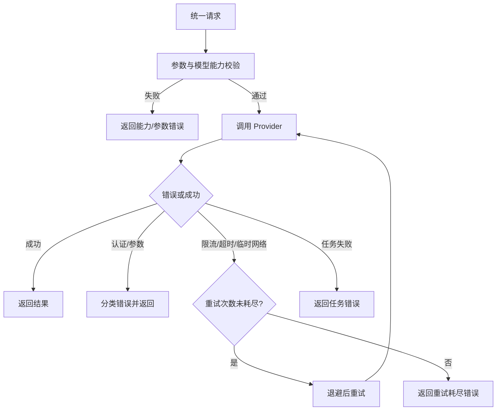

# 需求分支 PRD：能力检查与错误处理

## 0. 文档信息

- Sub ID：`SUB-004`
- 所属产品：AI Image SDK
- 总 PRD：`docs/prd/main-prd.md`
- Sub 目录：`docs/prd/sub-capability-error-handling/`
- 文档版本：v1.0.0
- 文档状态：草稿
- UI 类型：纯后端型，不生成 `ui.md`
- 来源说明：错误和能力规则来自总 PRD；具体 HTTP 状态映射来自各 Provider 接入确认。

## 1. 分支目标

在外部请求前识别模型能力和公共参数问题，在外部请求后将 Provider 错误映射为稳定、可诊断且不泄露敏感信息的错误类型，并对明确可恢复的错误执行有限重试。

## 2. 分支边界

### 2.1 本分支包含

- 模型能力检查。
- 公共参数和 Provider 选项校验。
- 认证、参数、能力、限流、超时、Provider 和任务错误。
- 有限自动重试及退避边界。
- 脱敏错误上下文。

### 2.2 本分支不包含

- Provider HTTP 请求和认证，由 `SUB-001` 负责。
- 统一生成函数请求结构，由 `SUB-002` 负责。
- 任务句柄和任务状态存储，由 `SUB-003` 负责。
- 业务级 fallback、智能路由、预算和内容审核决策。

### 2.3 与其他 Sub 的边界与协作

| 协作方 | 关系 |
|---|---|
| `SUB-001` | 提供能力声明、原始错误和可重试信号 |
| `SUB-002` | 在调用前触发参数与能力校验 |
| `SUB-003` | 接收任务超时、失败和中止错误 |
| `SUB-005` | 将用户可理解的错误展示给 Playground，不泄露内部信息 |

## 3. 用户角色

- SDK 调用方：根据错误类别修正请求或自行决定业务重试。
- SDK 维护者：诊断 Provider 兼容性和异常。
- Playground 用户：获得明确的输入、配置或服务错误提示。

## 4. 核心业务流程

**目的**：表达错误从检查、分类到有限重试和最终返回的路径。

**范围**：统一 SDK 调用链；不表达业务级 fallback。

**图例**：调用方、校验器、Provider、错误分类器；重试为有限虚线循环。

**关键假设**：Provider 能提供基本错误类别、HTTP 状态或可重试信号。

ASCII 草图：

```text
[请求] -> [能力/参数校验]
             |
       +-----+-----+
       v           v
   [不可用]      [可用]
       |           v
   [能力错误] -> [Provider 请求]
                     |
            +--------+--------+
            v        v        v
         [认证]   [可重试]  [永久错误]
            |        |        |
            v        v        v
          [返回] <- [有限重试] [分类返回]
```

Mermaid：



**异常路径**：未知错误必须归入稳定的内部错误类别并保留非敏感 cause；错误消息不得包含 token、完整请求头、prompt 中的敏感内容或堆栈。

**未覆盖范围**：自动换 Provider、内容政策判断和调用方业务补偿。

**关联需求**：`US-004`、`US-007`；`FEAT-001` 至 `FEAT-004`。

## 5. 包含的功能模块

| 功能 ID | 功能名称 | 目录 | 优先级 | 说明 |
|---|---|---|---|---|
| `FEAT-001` | 能力声明与检查 | `feat-capability-check` | P0 | 判断模型是否支持请求能力 |
| `FEAT-002` | 公共参数校验 | `feat-request-validation` | P0 | 校验公共参数和输入图片 |
| `FEAT-003` | 错误分类与脱敏 | `feat-error-taxonomy` | P0 | 统一错误类型和安全上下文 |
| `FEAT-004` | 有限自动重试 | `feat-retry-policy` | P0 | 对明确可恢复错误执行退避重试 |
| `FEAT-005` | 诊断上下文 | `feat-diagnostic-context` | P1 | 暴露非敏感 Provider/模型/任务信息 |

## 6. 用户故事

- `US-004`：不支持的编辑能力被显式拒绝。
- `US-007`：调用方能区分认证、参数、能力、限流和 Provider 失败。

## 7. 分支级业务规则

- 能力错误、认证错误、参数错误不自动重试。
- 仅对明确可恢复的限流、临时网络错误和超时重试。
- 重试必须有最大次数、最大总耗时和退避策略。
- 错误对象包含稳定 code、message、Provider/模型上下文和可选 cause，但不包含敏感凭证。
- SDK 不将内容安全拒绝改写为网络错误，也不绕过 Provider 安全策略。

## 8. 分支级数据与接口约定

- 能力声明包括操作类型、输入类型、参数支持、任务能力和结果能力。
- 错误至少包含错误类别、是否可重试、Provider 标识、模型/部署标识和外部任务标识（如有）。
- 重试策略包含最大次数、基础延迟、最大延迟和随机抖动。
- 日志上下文应可关联请求，但不得记录 API Key、完整 prompt 或图片内容。

## 9. 依赖与前置条件

- `SUB-001` 提供 Provider 级错误和能力信息。
- `SUB-002` 提供待校验请求。
- `SUB-003` 提供任务错误入口。
- 各平台的限流、认证、内容拒绝和任务错误语义需在接入前核实。

## 10. 分支验收标准

- [ ] 不支持能力在外部调用前返回稳定错误。
- [ ] 错误类别至少覆盖认证、参数、能力、限流、超时、Provider 和任务失败。
- [ ] 自动重试只针对可恢复错误且有上限。
- [ ] 错误和日志不泄漏凭证、令牌、堆栈和敏感图片内容。
- [ ] 调用方能通过错误类别决定修正请求或执行业务级重试。
- [ ] Provider 未知错误不会被伪装成成功。

## 11. 待确认事项

- 错误 code 的命名和是否兼容 HTTP 状态码语义。
- Provider 原始错误保留到何种粒度。
- 默认重试次数、退避算法和请求幂等条件。
- 内容安全拒绝是否使用独立错误类别。
- 是否提供可选 debug hook，以及其脱敏责任归属。

## 12. 变更记录

| 版本 | 日期 | 变更内容 |
|---|---|---|
| v1.0.0 | 2026-07-30 | 根据总 PRD 创建能力检查与错误处理分支草稿。 |
