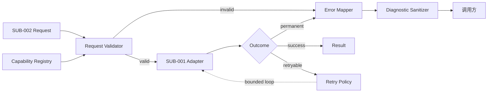
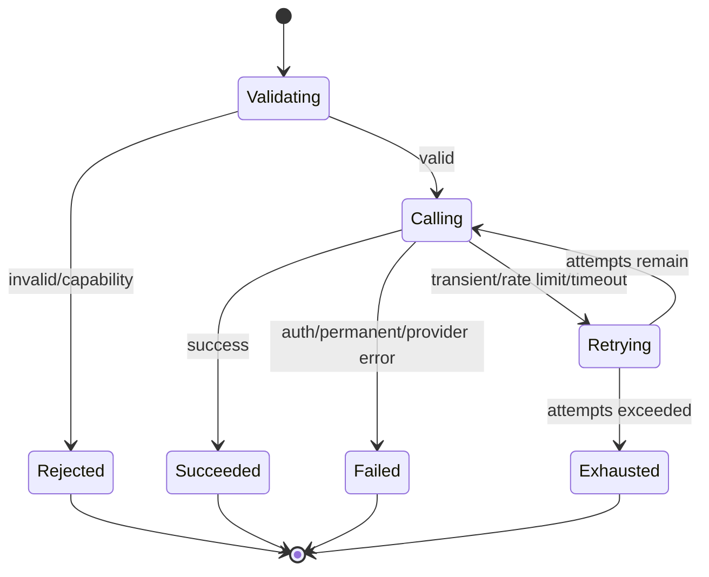
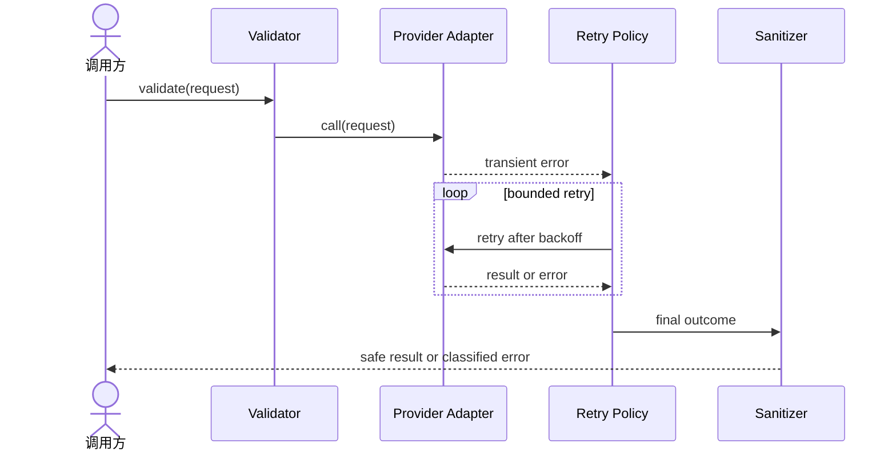
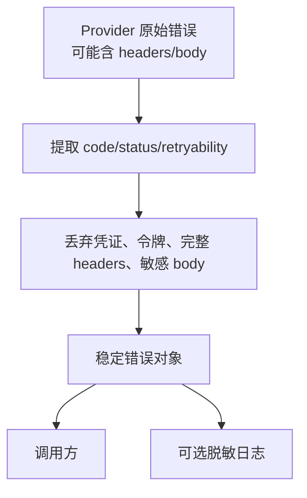

# 技术方案：能力检查与错误处理

## 0. 文档信息

- Sub：`SUB-004 能力检查与错误处理`
- 总 PRD：`docs/prd/main-prd.md`
- 对应需求文档：`./prd.md`
- 文档版本：v1.0.0
- 文档状态：草稿

## 1. 代码库事实与复用点

当前仓库没有错误基类、Provider HTTP 客户端或日志包；只有 Next.js/React 起始应用和共享 UI。SDK 错误体系应放在独立 package，不能复用 UI 或 Next.js 页面错误边界。根项目 TypeScript 基线为 `^5`、Node.js `>=20`。测试基线采用 `bun:test`（当前仓库无测试框架，实现阶段引入）。Provider 适配器为纯 fetch，错误分类可直接基于 HTTP 状态码（401→认证、429→限流、408/504→超时、4xx→参数/能力、5xx→Provider），无需反解官方 SDK 的错误类型。

## 2. 技术架构

- `CapabilityRegistry`：按 Provider/模型声明操作和参数支持。
- `RequestValidator`：校验公共参数、图片输入和 Provider 选项。
- `ErrorMapper`：将 Provider 错误转换为统一错误类型。
- `RetryPolicy`：判断可重试性、退避、次数和总时间。
- `DiagnosticSanitizer`：清理凭证、请求头、堆栈和敏感内容。

## 3. 模块架构图

**目的**：展示错误/能力边界与其他 sub 的集成方向。

**范围**：检查、映射、重试；不含业务 fallback。

**图例**：实线为同步调用，虚线为可选重试回环。

**假设**：Provider adapter 提供足够的非敏感错误上下文。

ASCII 草图：

```text
[SUB-002 请求] -> [Validator] -> [Capability Registry]
                         |                  |
                         +--错误----------> [Error Type]
                         v
                  [SUB-001 Adapter]
                         |
                 +-------+-------+
                 v       v       v
              [成功]  [可重试] [永久错误]
                         |
                         v
                   [Retry Policy]
                         |
                         v
                    [Sanitizer]
```

Mermaid：



**异常路径**：未知 Provider 错误进入 `UNKNOWN_PROVIDER_ERROR` 或等价稳定 code；重试耗尽不能被当成原始成功。

**相关模块**：`FEAT-001` 至 `FEAT-005`、`SUB-001`、`SUB-002`、`SUB-003`。

## 4. 错误模型建议

错误应具备稳定 code、用户安全 message、Provider/模型上下文、是否可重试、retry metadata 和可选脱敏 cause。建议初始类别：

- `AUTHENTICATION_ERROR`
- `INVALID_REQUEST_ERROR`
- `CAPABILITY_ERROR`
- `RATE_LIMIT_ERROR`
- `TIMEOUT_ERROR`
- `PROVIDER_ERROR`
- `TASK_ERROR`
- `RETRY_EXHAUSTED_ERROR`
- `UNKNOWN_ERROR`

最终命名和是否使用类继承由 feat 级技术方案确认。由于 Provider 为纯 fetch，`ErrorMapper` 优先基于 HTTP 状态码与平台错误体字段映射，Azure 与阿里云的限流/超时/认证语义须在接入时核对（Azure 429/Retry-After；阿里云 DashScope 任务状态与错误 code）。

## 5. 状态与重试流程



非法或危险行为：认证错误不重试；内容安全拒绝不重试；没有幂等条件的请求不得无限自动重放；重试不得改变 Provider 或模型。

## 6. 时序图

**目的**：表达一次可重试错误如何返回。

**范围**：统一请求到错误返回。

**参与者**：调用方、Validator、Provider、RetryPolicy、Sanitizer。

**假设**：Provider 错误可提取 HTTP/平台类别。

ASCII 草图：

```text
[调用方] -> [Validator] -> [Provider]
                              |
                       [限流/超时]
                              v
                       [Retry Policy]
                        |       |
                   重试未完  重试耗尽
                        |       v
                     [Provider] [Sanitizer] -> [错误]
```

Mermaid：



## 7. 数据流与安全



图片、prompt 和 API Key 默认视为敏感数据；日志只允许非敏感 Provider、模型、任务和错误类别。错误对象的 `cause` 不能直接序列化到用户响应。

## 8. 测试策略

- 测试框架：`bun:test`（`bun test`），不引入 Vitest/Jest。
- 能力矩阵单元测试：支持、不支持、未知模型。
- 错误映射 fixture：认证、限流、超时、内容拒绝、任务失败和未知响应（基于纯 fetch 的 HTTP 状态码与响应体 fixture）。
- 重试测试：次数、退避、最大时间、随机抖动和不可重试错误。
- 脱敏测试：API Key、Authorization、cookie、内部 URL、堆栈和图片数据。
- 跨 sub contract 测试：`SUB-001` 原始错误到统一错误，`SUB-003` 任务错误到终态。

## 9. 依赖与方案依据

- 当前项目无错误库和 Provider HTTP 依赖；不引入第三方重试库作为既定方案。
- 可优先使用 TypeScript 类型和 Node.js 原生 `AbortSignal`；是否引入运行时 schema 库待确认。
- Azure、Google、阿里云和 Seedream 的具体错误语义需在 Provider 接入时以官方资料验证。
- 未新增第三方 Context7 依赖；本 sub 依赖的是内部 Provider contract。

## 10. 备选方案

- 方案 A：只透传 Provider 原始错误。实现简单但调用方无法稳定判断重试。
- 方案 B：统一错误类别 + 有限重试 + 脱敏上下文。符合总 PRD，兼顾体验和安全。
- 方案 C：内置全局 fallback/routing。能力更强但超出 sub 边界并可能放大成本。
- 选择：方案 B。

## 11. 发布、兼容与回滚

- 错误 code 和 `retryable` 语义作为公共契约，变更需要版本评审。
- 新增错误类别可兼容；删除或改变调用方依赖的类别需 major 评估。
- Provider 映射异常时回退到稳定 `PROVIDER_ERROR`，不得暴露原始敏感响应。

## 12. 风险与待确认

- 各 Provider 对限流、超时、内容安全和任务失败的语义不一致。
- 自动重试可能增加成本和重复生成；需定义幂等与默认上限。
- 是否使用 Zod 或其他 runtime schema 需要结合 SDK package 设计确认。

## 13. 变更记录

| 版本 | 日期 | 变更内容 |
|---|---|---|
| v1.0.0 | 2026-07-30 | 创建能力检查与错误处理技术方案。 |
| v1.1.0 | 2026-07-30 | 登记 `bun:test` 测试基线与纯 fetch 的 HTTP 状态码→错误类别映射方案。 |
