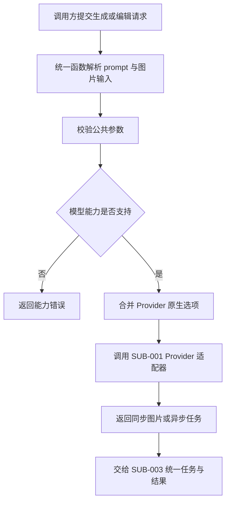

# 需求分支 PRD：统一图像生成与编辑

## 0. 文档信息

- Sub ID：`SUB-002`
- 所属产品：AI Image SDK
- 总 PRD：`docs/prd/main-prd.md`
- Sub 目录：`docs/prd/sub-image-generation/`
- 文档版本：v1.1.0
- 文档状态：草稿
- UI 类型：纯后端型，不生成 `ui.md`
- 来源说明：目标和范围来自总 PRD；模型差异和参数支持需由 `SUB-001` 的能力声明确认。

## 1. 分支目标

定义跨 Provider 的图像生成与编辑公共契约，让调用方用稳定的统一函数调用文生图，并在模型支持时调用图生图/图片编辑，同时通过 `providerOptions` 使用平台独有能力。

## 2. 分支边界

### 2.1 本分支包含

- 统一生成函数和编辑函数的调用语义。
- 公共 prompt、图片输入、尺寸/格式等参数的最小契约。
- 模型级输出数量、最大分辨率和编辑能力校验。
- Provider 模型实例接入。
- 按模型能力开放图生图、多图和 mask 等能力。
- 统一结果入口和 Provider 元数据传递约定。

### 2.2 本分支不包含

- Provider 认证和平台请求转换，由 `SUB-001` 负责。
- 任务句柄内部存储、轮询和等待实现，由 `SUB-003` 负责。
- 全局错误分类和重试，由 `SUB-004` 负责。
- 图片长期存储、内容审核平台和 Web Playground。

### 2.3 与其他 Sub 的边界与协作

| 协作方 | 关系 |
|---|---|
| `SUB-001` | 提供模型实例、能力声明和 Provider 适配入口 |
| `SUB-003` | 承接同步/异步生成结果，提供统一任务和结果读取 |
| `SUB-004` | 校验公共参数、能力冲突并映射错误 |
| `SUB-005` | 使用公共函数构建 examples 和 Playground 请求 |

## 3. 用户角色

- Node.js 后端开发者：使用统一函数完成生成。
- AI 应用开发者：对图片进行参考图编辑并保留 Provider 能力。
- SDK 维护者：扩展公共参数而不破坏已有 Provider。

## 4. 核心业务流程

**目的**：说明生成/编辑请求如何经过公共契约和能力判断。

**范围**：从调用方提交 prompt 到获得标准结果。

**图例**：统一函数、能力声明、Provider 适配器和任务结果；虚线表示按能力开放的路径。

**关键假设**：调用方已选择模型实例；图片输入可能是 Buffer、URL 或其他 Node.js 二进制表示。

ASCII 草图：

```text
[调用方] -> [generateImage/editImage]
                    |
                    v
             [公共参数校验]
                    |
             +------+------+
             |             |
        不支持能力      支持能力
             |             v
        [能力错误] -> [Provider 适配]
                              |
                              v
                      [统一结果/任务句柄]
```

Mermaid：



**异常路径**：图片输入无法读取、公共参数冲突、模型不支持编辑、Provider 选项命名空间错误时不发起外部调用；外部失败交给 `SUB-004`。

**未覆盖范围**：具体模型参数全集、自动 prompt 改写和内容安全决策。

**关联需求**：`US-003`、`US-004`、`US-008`；`FEAT-001` 至 `FEAT-005`。

## 5. 包含的功能模块

| 功能 ID | 功能名称 | 目录 | 优先级 | 说明 |
|---|---|---|---|---|
| `FEAT-001` | 统一文生图函数 | `feat-text-to-image` | P0 | 接收模型、prompt 和公共生成参数 |
| `FEAT-002` | 图生图与图片编辑函数 | `feat-image-editing` | P0 | 按模型能力接收参考图、mask 或多图 |
| `FEAT-003` | 公共图片输入契约 | `feat-image-input` | P0 | 统一 Buffer、URL 和二进制读取方式 |
| `FEAT-004` | 公共参数与 Provider 选项 | `feat-generation-options` | P0 | 定义公共参数和 `providerOptions` 边界 |
| `FEAT-005` | 生成结果入口 | `feat-generation-result` | P0 | 统一图片、URL、元数据和任务引用 |

## 6. 用户故事

- `US-003`：调用方用统一函数执行文生图。
- `US-004`：调用方按模型能力执行图片编辑。
- `US-005`：调用方获得可读取的图片结果、URL 和元数据。

## 7. 分支级业务规则

- 公共契约只承诺跨首批 Provider 可验证的最小能力。
- 模型不支持的参数必须显式报错，不得静默删除。
- `providerOptions` 只能携带对应 Provider 的命名空间参数。
- 编辑输入的数量、mask、格式和大小由模型能力声明限制。
- 公共函数不负责把结果上传到对象存储。
- 不承诺不同 Provider 生成结果的内容、质量、尺寸语义完全一致。
- 阿里云百炼模型的能力必须按模型实例校验：例如 `wan2.6-t2i` 只允许文生图，而 `wan2.7-image-pro`、`wan2.7-image` 和 Qwen Image 推荐模型可按矩阵支持编辑。
- 阿里云模型的最大输出数和最大分辨率不能被统一参数默认放大；超出模型能力必须在请求前报错。

## 8. 分支级数据与接口约定

- 统一请求至少包含模型实例和 prompt。
- 编辑请求可包含参考图片集合；图片的本地读取、URL 下载和 MIME 推断需要有明确策略。
- 公共参数应包括经验证的尺寸/格式/数量等字段；其余能力走 Provider 选项。
- 能力注册表至少能表达 operation、maxImages、maxWidth、maxHeight、supportsEditing 和是否邀测。
- 统一结果包含图片内容读取入口、可用 URL、Provider/模型标识、任务引用和非敏感元数据。
- 参数校验失败不得发起 Provider 请求。

## 9. 依赖与前置条件

- `SUB-001` 提供 Provider 模型实例和能力声明。
- `SUB-003` 提供任务与结果接口。
- `SUB-004` 提供参数错误和能力错误类型。
- 具体 Provider 的图片输入、编辑和输出限制需在接入前确认。

## 10. 分支验收标准

- [ ] 文生图可以通过统一函数提交到至少一个已配置 Provider。
- [ ] 图片编辑仅在模型能力声明支持时可提交。
- [ ] Buffer/URL 等公共图片输入能被明确校验并传递。
- [ ] Provider 原生参数被限制在正确命名空间。
- [x] 参数/能力错误在外部请求前返回。
- [x] 同步和异步 Provider 都能转换为 `SUB-003` 可消费的结果。
- [x] 阿里云百炼推荐模型能力矩阵能校验编辑支持、最大输出数和最大分辨率。

## 11. 待确认事项

- ~~统一函数命名采用 `generateImage`/`editImage`，还是统一一个支持文本和图片 prompt 的函数。~~ 已决：采用 `generateImage`/`editImage` 双入口。
- ~~公共参数首期包含哪些尺寸、质量、数量和格式字段。~~ 已决（2026-08-05，OpenSpec `model-aware-params`）：公共参数为 `size`/`n`，按 `ModelCapability.supportedSizes`/`maxResolution`/`maxN` 在 `generateImage` 预检阶段按模型条件校验；质量/格式等 Provider 原生字段经 `providerOptions.<namespace>` 透传。
- URL 输入是否由 SDK 下载，还是要求 Provider 原生接受 URL。
- 结果默认提供 URL、二进制，还是惰性读取对象。
- ~~多图片和 mask 是否进入 MVP 公共契约，还是仅走 Provider 能力扩展。~~ 已决：多图片输入（`images: ImageContent[]`）进入公共契约；mask 仅走 Provider 能力扩展。
- ~~百炼连续生成"最多 12 张"的能力是否作为独立操作暴露，还是首期仅保留单次输出数约束。~~ 已决：首期仅保留单次输出数约束（`maxN`）；连续 12 张作为 Wan 家族 `providerOptions.aliyun.enable_sequential` 原生选项。

## 12. 变更记录

| 版本 | 日期 | 变更内容 |
|---|---|---|
| v1.0.0 | 2026-07-30 | 根据总 PRD 创建统一图像生成与编辑分支草稿。 |
| v1.1.0 | 2026-07-30 | 根据百炼资料补充模型级能力、最大输出数和分辨率校验要求。 |
