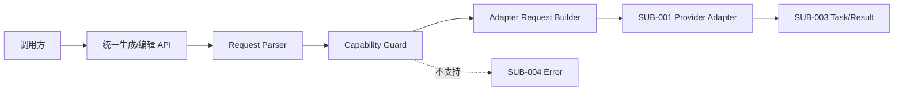
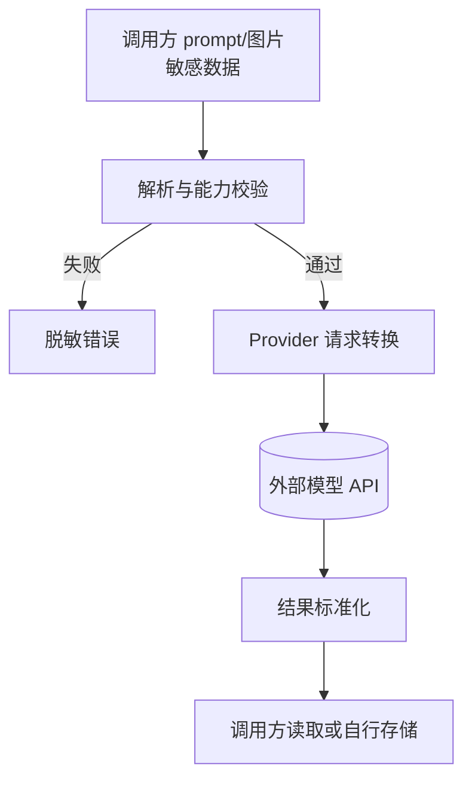
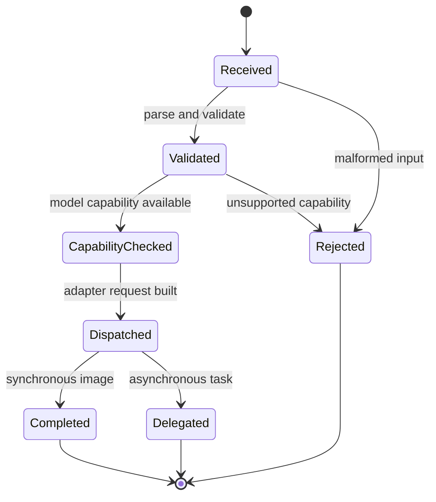
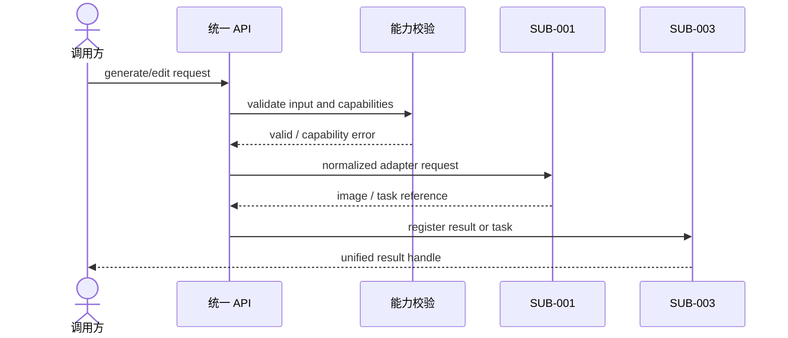

# 技术方案：统一图像生成与编辑

## 0. 文档信息

- Sub：`SUB-002 统一图像生成与编辑`
- 总 PRD：`docs/prd/main-prd.md`
- 对应需求文档：`./prd.md`
- 文档版本：v1.1.0
- 文档状态：草稿

## 1. 代码库事实与复用点

当前仓库没有 SDK package 或图像业务代码；根 workspace 只有 `apps/*` 和 `packages/*`。实现阶段建议新增独立 SDK package，避免把核心契约放进 `apps/web`。当前 Node.js 基线为 `>=20`，TypeScript 版本为 `^5`。

## 2. 技术架构

核心类型按**模态无关泛型**设计，MVP 仅实例化图像，视频/音频后续复用：

- `ImageModel`：不可变 Provider 模型实例。
- `GenerateRequest`：prompt、公共生成参数、providerOptions。
- `EditRequest`：prompt、图片输入、可选 mask/多图能力。
- `Capability`：模型支持的操作和参数。
- `Capability` 至少表达 `supportsTextToImage`、`supportsImageEdit`、`maxImages`、`maxWidth`、`maxHeight` 和邀测/可用状态。
- `GenerationResult<TContent>`：模态无关泛型结果（图片读取、URL、元数据、任务引用）；MVP 实例化为 `GenerationResult<ImageContent>`，后续 `VideoContent`/`AudioContent` 复用同结构。
- `TaskHandle<TContent>`：进程内任务句柄泛型（详见 SUB-003）；同步结果直接进入 Succeeded，异步结果走轮询。
- `AdapterRequest`：统一请求经过能力校验后交给 `SUB-001`。
- 顶层入口：MVP 实现 `generateImage`/`editImage`；`generateVideo`/`generateAudio` 仅预留签名，不实现（SUB-006/007）。

统一函数不直接判断 Azure、Google 等平台；通过模型能力和适配器接口完成分派。

## 3. 模块架构图

**目的**：描述公共契约到 Provider 适配的分层。

**范围**：生成/编辑 sub 内部，不展开函数实现。

**图例**：实线同步调用，虚线为按能力启用的编辑路径。

**假设**：结果任务化由 `SUB-003` 承接。

ASCII 草图：

```text
[调用方]
    |
    v
[generateImage/editImage]
    |
    +--> [Request Parser] --> [Capability Guard]
                                  |
                                  v
                         [Adapter Request Builder]
                                  |
                         +--------+--------+
                         v                 v
                    [SUB-001 Adapter]  [SUB-004 Error]
                                  |
                                  v
                         [SUB-003 Result]
```

Mermaid：



**异常路径**：解析失败或能力不支持在外部调用前返回；Provider 失败由 `SUB-004` 统一处理。

**相关模块**：`FEAT-001` 至 `FEAT-005`、`SUB-001`、`SUB-003`、`SUB-004`。

## 4. 核心契约建议

- `generateImage({ model, prompt, ... })`：AI SDK 风格的文生图入口。
- `editImage({ model, prompt, images, ... })`：显式编辑入口，或后续合并为结构化 prompt；最终命名待确认。
- `providerOptions` 按 Provider 命名空间隔离，类型由 Provider 提供。
- 图片输入建立统一 `ImageInput` 表示，支持 Buffer、URL 和可扩展的 Blob/流输入；Node.js 首期优先验证 Buffer/URL。
- 公共尺寸字段不应假设 `aspectRatio` 对所有模型有效；Azure DALL-E 资料明确偏向 `size`，因此需能力化建模。
- 阿里云百炼模型使用能力注册表进行模型级校验：`z-image-turbo` 禁止编辑；`wan2.7-image-pro` 文生图最大 4096x4096、编辑最大 2048x2048；其他推荐模型按其最大 2048x2048 和输出数量约束。
- `maxImages` 必须按请求操作校验；百炼推荐模型通常为 4 或 6 张，连续生成 12 张是否作为独立能力待确认。

## 5. 数据流图

**目的**：说明 prompt、图片和结果的来源、处理、边界和消费方。

**范围**：一次生成/编辑请求。

**图例**：敏感数据包括 prompt 和图片；SDK 内存处理不等同于持久化。

**假设**：调用方负责结果长期存储。

ASCII 草图：

```text
[调用方 prompt/图片]
          |
          v
[解析与能力校验] --拒绝--> [脱敏错误]
          |
          v
[Provider 请求转换] --> [外部模型 API]
          |
          v
[统一结果映射] --> [调用方读取/自行存储]
```

Mermaid：



**异常路径**：URL 下载失败、MIME 不匹配、输入过大、Provider 拒绝和结果无法解析均必须带错误类别。

## 6. 状态与时序

统一函数本身不维护任务状态；同步结果直接进入 `Succeeded`，异步结果交给 `SUB-003`。



非法转换：拒绝请求不得进入外部调用；已完成请求不得重新进入校验或分派。



## 7. 安全与输入校验

- 不记录完整 prompt、图片内容和凭证。
- URL 输入需要限制协议、大小、超时和重定向策略；具体安全参数待实现评审。
- 统一契约不能绕过 Provider 内容安全限制。
- MIME、大小、图片数量和 mask 关系由能力声明校验。
- 分辨率和输出数量校验必须使用模型能力，不得只使用 Provider 级默认值。

## 8. 测试策略

- 公共契约单元测试：生成、编辑、图片输入和 providerOptions 类型边界。
- 能力矩阵测试：每种能力支持/不支持的行为。
- Adapter contract mock：验证统一请求构建而不访问真实 Provider。
- 结果兼容测试：URL、二进制、MIME、元数据和任务引用。
- 与 `SUB-001` 做跨 sub 契约测试，与 `SUB-004` 做错误分类测试。

## 9. 依赖和方案依据

- 当前项目 TypeScript `^5`、Node.js `>=20` 是代码库事实。
- AI SDK Azure 资料展示 `azure.image(deploymentName)` 和 `size` 对 DALL-E 的适配参考：https://ai-sdk.dev/providers/ai-sdk-providers/azure，Context7 查询日期 2026-07-30。
- Google Gen AI JS SDK 资料展示通过 `response_modalities: ['image']` 获取图像输出：https://googleapis.github.io/js-genai，Context7 查询日期 2026-07-30。
- 阿里云百炼模型能力依据用户提供的官方资料：文本生成图像、Qwen Image 编辑和 Wan 图像编辑文档（2026-07-30）。资料确定模型能力矩阵，但未确定本项目应采用的 HTTP/SDK 请求实现。
- 本 sub 不直接引入 AI SDK 或 Google SDK；是否采用官方 SDK 作为 Provider 内部实现依赖待 `SUB-001` 接入评审确认。

## 10. 发布、兼容与回滚

- 统一函数和核心类型首次发布前锁定为 alpha 契约。
- 增加可选字段优先，删除/改名需要 minor/major 版本评审。
- Provider 特有参数不得成为公共字段的隐式替代。
- 若某 Provider 适配失败，保持统一 API 可用并单独标记 Provider 能力不可用。

## 11. 风险与待确认

- 不同 Provider 对图片输入、尺寸和输出的语义差异可能迫使公共字段变为能力条件字段。
- 是否支持多图/mask 进入公共 MVP 需结合首批模型实际能力确认。
- 百炼模型的连续生成 12 张是否进入公共契约，以及 Qwen Image 负向提示词是否作为公共字段或 Provider 选项，待 API 设计确认。
- URL 下载会带来 SSRF、内存和超时风险。

## 12. 变更记录

| 版本 | 日期 | 变更内容 |
|---|---|---|
| v1.0.0 | 2026-07-30 | 创建统一图像生成与编辑技术方案。 |
| v1.1.0 | 2026-07-30 | 根据百炼资料补充模型级能力注册、分辨率和输出数量校验方案。 |
| v1.2.0 | 2026-07-30 | 核心类型模态无关泛型化（`GenerationResult<T>`/`TaskHandle<T>`），预留 `generateVideo`/`generateAudio` 入口；对齐 `@ai-media/*` 包 scope 与纯 fetch Provider。 |
