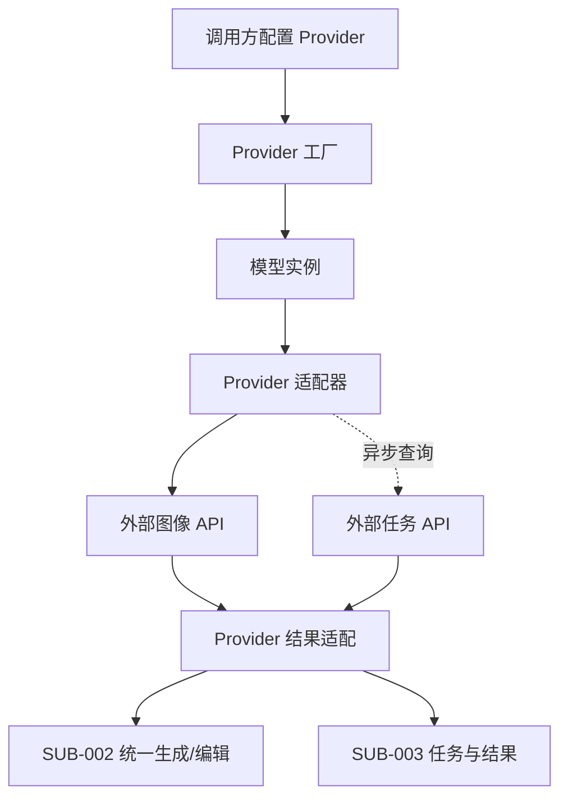

# 需求分支 PRD：Provider 适配体系

## 0. 文档信息

- Sub ID：`SUB-001`
- 所属产品：AI Image SDK
- 总 PRD：`docs/prd/main-prd.md`
- Sub 目录：`docs/prd/sub-provider-adapters/`
- 文档版本：v1.2.0
- 文档状态：草稿
- UI 类型：纯后端型，不生成 `ui.md`
- 来源说明：产品范围来自总 PRD；仓库事实来自当前 monorepo；Provider 能力来自外部官方/参考资料；Context7 已确认 DashScope 无官方 JS/TS SDK；未确认内容标记为待确认。

## 1. 分支目标

为统一图像生成与编辑 API 提供可扩展的 Provider 工厂、模型实例和外部平台适配边界，使调用方能够显式选择 Provider/模型，而不在业务代码中处理平台认证、请求格式和响应格式差异。

首批 Provider：

- Azure OpenAI 图像 Provider；模型实例使用 Azure deployment name。
- Google 图像 Provider；具体 Gemini 图像模型待确认。
- 阿里云百炼图像 Provider；首期推荐模型为 `wan2.7-image-pro`、`wan2.7-image`、`z-image-turbo`、`qwen-image-2.0-pro` 和 `qwen-image-2.0`，具体 API 产品和认证方式待确认。
- 字节 Doubao-Seedream Provider；具体官方接入渠道、模型和任务 API 待确认。

## 2. 分支边界

### 2.1 本分支包含

- Provider 工厂及 Provider 配置。
- 模型实例和模型标识。
- API Key/endpoint/deployment 等 Provider 认证与连接配置。
- 各 Provider 的生成、编辑、任务查询和结果适配入口。
- Provider 能力声明和 Provider 原生参数命名空间。
- Azure OpenAI、Google、阿里云、Doubao-Seedream 首批适配。
- 对外部 SDK 或 HTTP API 差异的隔离。

### 2.2 本分支不包含

- 统一 `generateImage`/`editImage` 的业务语义和公共参数定义，由 `SUB-002` 负责。
- 进程内任务注册、等待和结果生命周期，由 `SUB-003` 负责。
- 全局错误层级、能力错误呈现和重试策略，由 `SUB-004` 负责。
- Web Playground、examples 页面和文档导航，由 `SUB-005` 负责。
- 自动模型路由、跨 Provider fallback、统一计费和密钥托管。

### 2.3 与其他 Sub 的边界与协作

| 协作方 | 关系 |
|---|---|
| `SUB-002` | 消费 Provider 模型实例、能力声明和适配后的统一调用接口 |
| `SUB-003` | Provider 提供任务提交/查询/取结果能力，任务 Sub 负责进程内生命周期 |
| `SUB-004` | Provider 报告原始错误、可重试信号和能力不支持信息，错误 Sub 负责统一分类 |
| `SUB-005` | Examples 通过公开 Provider 工厂验证配置和最小调用路径 |

## 3. 用户角色

- Node.js 后端开发者：配置 Provider 并选择部署/模型。
- AI 应用开发者：切换 Provider，同时使用平台独有参数。
- SDK 维护者：新增 Provider 而不修改既有统一调用契约。

## 4. 核心业务流程

**目的**：说明 Provider 配置、模型创建和请求适配路径。

**范围**：Provider 创建到返回统一适配结果；不展开统一生成函数内部规则。

**图例**：调用方、Provider 工厂、模型实例、适配器、外部平台；实线为同步调用，虚线为异步任务查询。

**关键假设**：调用方自行提供凭证；Provider 具体认证方式仍可能因平台而不同。

ASCII 草图：

```text
[调用方] -> 创建 Provider 配置 -> [Provider 工厂]
                                      |
                                      v
                               [模型实例]
                                      |
                         统一请求 -> [Provider 适配器]
                                      |
                         +------------+------------+
                         v                         v
                 [外部图像 API]             [任务查询 API]
                         |                         |
                         +------ 适配结果 <---------+
                                      |
                                      v
                              [SUB-002/003]
```

Mermaid：



**异常路径**：配置缺失、认证失败、endpoint 不匹配、deployment 不存在、Provider API 返回不支持能力时，适配器返回带 Provider 上下文的原始结构，由 `SUB-004` 分类；不在适配器内静默切换其他 Provider。

**未覆盖范围**：统一重试次数、公共参数校验和 UI 配置。

**关联需求**：`US-001`、`US-002`、`US-008`；`FEAT-001` 至 `FEAT-005`。

## 5. 包含的功能模块

功能目录由 `/oc-prd-feat` 后续创建；本次只在 sub PRD 中登记，不创建 `feat-*` 目录。

| 功能 ID | 功能名称 | 目录 | 优先级 | 说明 |
|---|---|---|---|---|
| `FEAT-001` | Provider 工厂与模型实例 | `feat-provider-factory` | P0 | 创建 Provider、绑定配置并生成模型实例（核心包 `@ai-media/sdk`） |
| `FEAT-002` | Azure OpenAI 图像 Provider | `feat-provider-azure-openai` | P0 | 适配 Azure deployment、图像模型请求和结果；包 `@ai-media/provider-azure-openai`；纯 fetch，仅 API Key 鉴权 |
| `FEAT-003` | Google 图像 Provider | `feat-provider-google` | P0 | 适配 Google 图像模型请求和结果；包 `@ai-media/provider-google`；纯 fetch |
| `FEAT-004` | 阿里云百炼 Provider | `feat-provider-aliyun-bailian` | P0 | 适配百炼图像生成/编辑接口和推荐模型能力矩阵；包 `@ai-media/provider-aliyun-bailian`；纯 fetch（DashScope 无 JS SDK）；wan/qwen 是否拆包待契约探查 |
| `FEAT-005` | Doubao-Seedream Provider | `feat-provider-seedream` | P0 | 适配 Seedream 生成/编辑接口，官方入口待确认；包 `@ai-media/provider-seedream`；纯 fetch |
| `FEAT-006` | Provider 能力与原生选项 | `feat-provider-capabilities` | P0 | 声明模型能力并隔离 `providerOptions` |

## 6. 用户故事

- `US-001`：调用方可以用 Provider 工厂配置凭证，而不拼接平台 HTTP 请求。
- `US-002`：调用方可以通过模型实例显式选择 Provider 下的模型或 deployment。
- `US-008`：维护者可以通过 Provider 原生选项支持平台独有能力。

## 7. 分支级业务规则

- Azure OpenAI 的模型实例标识为 deployment name，不作为跨平台模型别名。
- Provider 不主动读取或持久化 API Key；密钥只用于运行时请求。
- Provider 必须声明生成、编辑、图片输入、尺寸、格式和任务查询能力。
- 阿里云百炼模型能力必须按模型注册，不能把 `z-image-turbo` 的文生图能力误报为支持图片编辑。
- 阿里云推荐模型目录至少记录生成/编辑支持、最大输出数、最大分辨率和邀测状态。
- Provider 独有参数必须置于其命名空间下；命名空间最终命名待统一 SDK 契约确认。
- Provider 适配器必须保留非敏感的 Provider、模型、请求和外部任务标识。
- 具体模型不在总 PRD 固定；Provider 能力应可随模型标识变化。
- Provider 适配器统一通过核心包可注入的 `transport`（fetch、超时、请求头）调用外部平台，**不包装官方 SDK**；Azure OpenAI 仅支持 API Key（`api-key` 头）鉴权。
- 阿里云百炼无官方 JS/TS SDK，`@ai-media/provider-aliyun-bailian` 必须原生 fetch 直连 DashScope REST API；wan 与 qwen 文生图契约是否共用、编辑契约是否分叉，须在接入前 live 探查确认后再决定是否拆包。

## 8. 分支级数据与接口约定

- Provider 配置：API Key 或其他认证凭证、base URL/endpoint、API version、请求头、超时和 fetch 实现。
- 模型实例：Provider 标识、模型/部署标识、能力声明和 Provider 局部配置。
- 适配请求：统一层输入、Provider 原生选项、请求追踪上下文。
- 适配响应：Provider 任务标识、状态、图片引用、Provider 元数据和可分类原始错误。
- 适配层不得直接暴露完整认证头、令牌和敏感原始响应。

## 9. 依赖与前置条件

- `SUB-002` 定义统一生成/编辑请求契约。
- `SUB-003` 定义 Provider 任务能力接口。
- `SUB-004` 定义错误分类和可重试信号。
- Azure OpenAI 的 endpoint、API version、认证方式和图像部署已配置。
- Google、阿里云、Doubao-Seedream 的首期具体模型/API 需在接入前确认。
- 阿里云首期模型选择依据来自百炼资料；API endpoint、认证、请求字段和任务接口仍需确认。

## 10. 分支验收标准

- [ ] 四类首批 Provider 均能通过统一工厂创建，或明确标记其外部资料缺口。
- [ ] Azure OpenAI 使用 deployment name 创建图像模型实例。
- [ ] Provider 配置不把真实密钥写入日志、代码或错误信息。
- [ ] Provider 能力声明能阻止不支持参数静默下传。
- [ ] Provider 原生选项不会污染其他 Provider 的参数类型。
- [ ] Provider 任务和结果能被 `SUB-002`、`SUB-003` 消费。
- [ ] 阿里云百炼首期推荐模型的文生图/编辑、最大输出数和最大分辨率能力已注册并可校验。
- [ ] 每个 Provider 至少有一个 example 配置说明。

## 11. 待确认事项

- Azure OpenAI 采用 DALL-E 图像模型路径、Responses API 图像生成工具路径，还是两者都支持。
- Azure endpoint、API version、必要请求头和 `providerOptions.azure` vs 兼容 `openai` 命名空间的最终配置结构（鉴权已确认仅 API Key）。
- Google 首期使用 Gemini Developer API、Vertex AI，或同时支持两者。
- 阿里云百炼具体 REST endpoint、地域、异步任务/轮询接口字段、返回 URL 生命周期和邀测可用性；wan 与 qwen 编辑契约是否共用，决定是否拆 `provider-aliyun-bailian-wan` / `-qwen`。
- Doubao-Seedream 首期官方 API 入口；当前参考资料包含第三方托管接口，不视为字节官方契约。
- 各 Provider 是否真的支持统一范围内的图像编辑与异步查询。

## 12. 变更记录

| 版本 | 日期 | 变更内容 |
|---|---|---|
| v1.0.0 | 2026-07-30 | 根据总 PRD 创建 Provider 适配分支草稿。 |
| v1.1.0 | 2026-07-30 | 根据百炼资料补充阿里云推荐模型目录和模型级能力验收要求。 |
| v1.2.0 | 2026-07-30 | 锁定 `@ai-media/provider-*` 包名、纯 fetch 零外部 SDK 依赖、Azure 仅 API Key；确认 DashScope 无 JS SDK；wan/qwen 拆分改为探查后再定。 |
