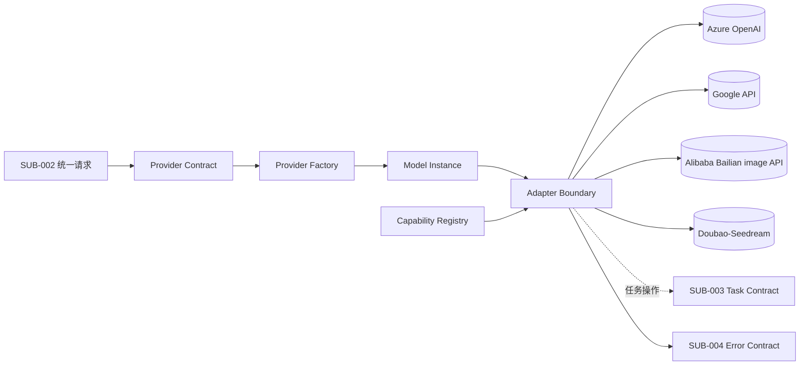
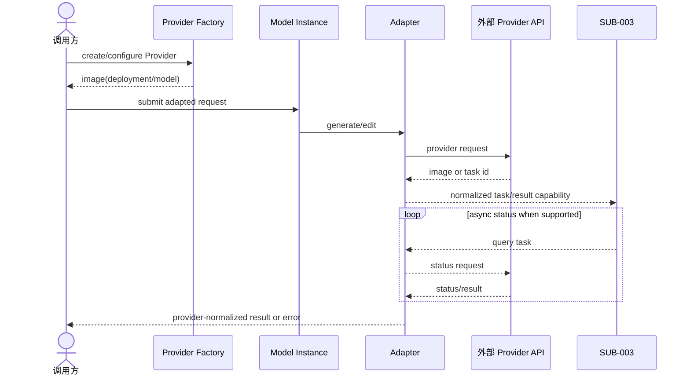
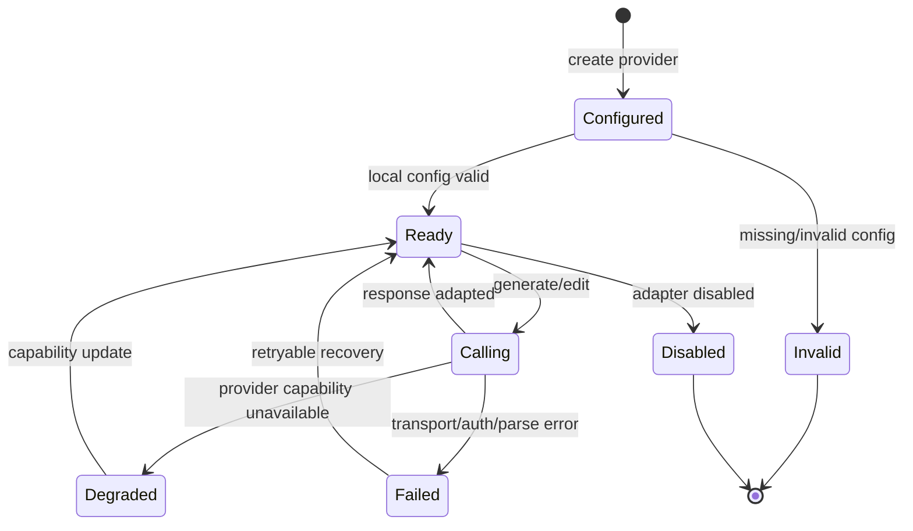
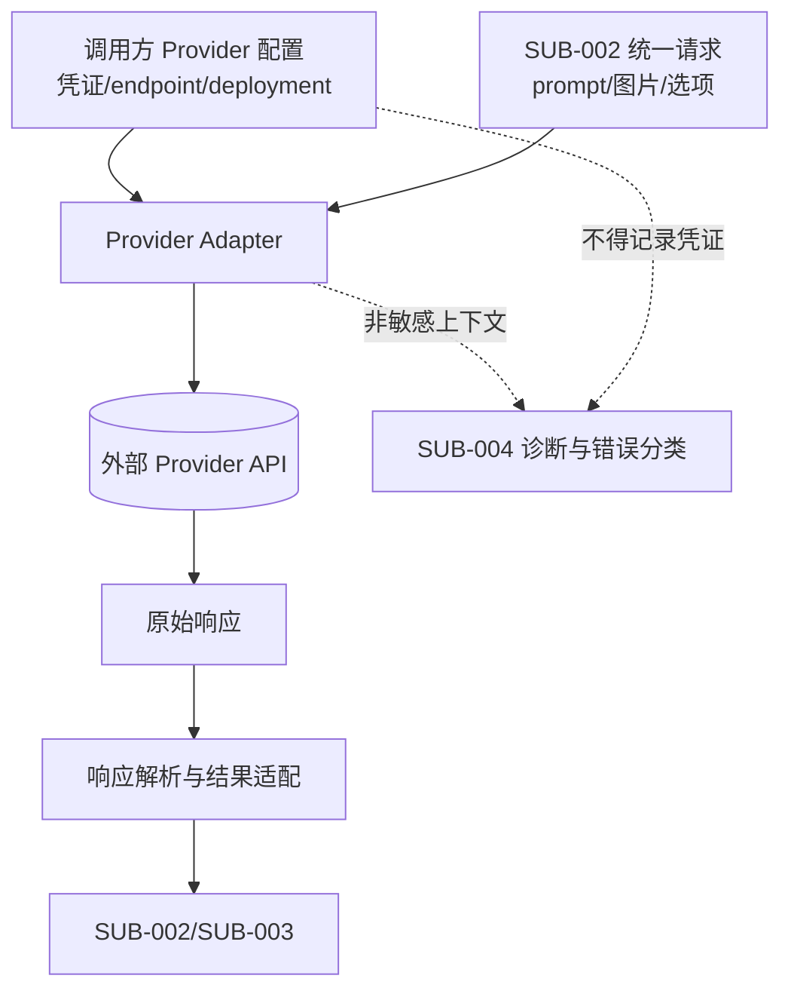

# 技术方案：Provider 适配体系

## 0. 文档信息

- Sub：`SUB-001 Provider 适配体系`
- 总 PRD：`docs/prd/main-prd.md`
- 对应需求文档：`./prd.md`
- 文档版本：v1.8.0
- 文档状态：草稿
- 方案性质：独立 Provider 契约，参考 AI SDK，不将 AI SDK 作为核心运行时依赖；Provider 适配器纯 fetch，不包装官方 SDK

## 1. 代码库事实与复用点

当前仓库事实：

- 根目录是 Bun workspace + Turborepo monorepo，根包名 `ai-media-sdk`（scope `@ai-media/*`）。工作区匹配 `apps/*`、`packages/*`，待加 `examples/*`。
- 当前只有 `apps/web` 和 `packages/ui`，没有 SDK package、Provider package、examples workspace 或业务 API。
- `packages/ui` 已迁移到 shadcn 子目录约定（`@workspace/ui/components/shadcn/*`）；本 sub 不直接依赖 UI。
- `apps/web` 使用 Next `16.2.6`、React `19.2.4`、TypeScript `^5`。
- 根包要求 Node.js `>=20`，包管理器为 Bun `1.3.14`；测试基线待引入 `bun:test`（当前仓库无测试框架）。

这些事实意味着本 sub 需要新增 SDK package 结构：核心契约包 `@ai-media/sdk` 与各 Provider 包 `@ai-media/provider-<name>`；本次只记录架构，不安装包或修改业务代码。

## 2. 分层架构

建议分层：

- `core contract`：Provider、ImageModel、Capability、AdapterResult 的独立 TypeScript 类型。
- `provider factory`：创建 Provider 实例并读取调用方配置。
- `provider adapter`：逐平台负责请求映射、响应解析、任务操作。
- `transport`：可注入 fetch、超时和请求头处理；不绑定具体 HTTP 客户端。
- `diagnostics`：生成非敏感请求/任务上下文，交给 `SUB-004`。

Provider 适配器不得依赖 `SUB-002` 的业务实现，统一层通过接口反向调用适配器。Provider 适配器一律通过共享 `transport`（可注入 fetch、超时、请求头）发起 HTTP，**不引入或包装官方 SDK**；官方 SDK/文档仅作为契约调研参考。Azure OpenAI 仅支持 API Key（`api-key` 头）鉴权。

## 3. 模块架构图

**目的**：表达 Provider sub 内部边界、外部服务和跨 sub 依赖。

**范围**：Provider 适配器层，不展开函数和具体 HTTP 方法。

**图例**：实线为同步依赖，虚线为异步任务能力；外部系统在边界外。

**关键假设**：每个 Provider 都可以通过适配器表达同步或异步结果；具体模型能力待接入确认。

ASCII 草图：

```text
[SUB-002 统一请求]
          |
          v
[Provider Contract] -> [Provider Factory]
          |                    |
          v                    v
[Capability Registry]    [Model Instance]
          |                    |
          +----------> [Adapter Boundary]
                              |
             +----------------+----------------+
             v                v                v
      [Azure OpenAI]      [Google]       [Alibaba/Seedream]
             |                |                |
             v                v                v
         [外部 API]        [外部 API]       [外部 API]
                              |
                    [SUB-003 / SUB-004]
```

Mermaid：



**异常路径**：配置缺失在工厂或请求前失败；外部认证、模型不存在、限流和未知响应进入统一错误契约；不自动切换 Provider。

**相关模块**：`FEAT-001` 至 `FEAT-006`、`SUB-002`、`SUB-003`、`SUB-004`。

## 4. Provider 设计

建议公共 Provider 接口具备以下能力概念：

- `createProvider(config)`：绑定凭证、endpoint、API version、headers 和 fetch。
- `image(modelOrDeployment)`：创建不可变模型实例。
- `capabilities(model)`：返回操作、输入、输出和任务能力。
- `generate(request)` / `edit(request)`：接收已经过统一层校验的适配请求。
- `getTaskStatus(taskId)` / `getTaskResult(taskId)`：仅由支持异步的 Provider 实现。

不预先固定具体函数名和泛型形状，最终公共契约由 `SUB-002`、`SUB-003` 和 feat 级文档确认。

### 4.1 Azure OpenAI

- 参考 AI SDK 的 `azure.image(deploymentName)` 心智模型。
- deployment name 是 Azure 资源中的部署标识，不等同于跨平台模型 alias。
- Provider 配置至少需要考虑 endpoint、deployment、API version 和必要 Azure headers；**鉴权为 API Key（Phase 1 live 确认为 `Authorization: Bearer {apiKey}` 头，适用 Global Standard `gpt-image-2` 等 Serverless 部署）**；经典 Azure OpenAI 资源亦支持 `api-key` 头，作为备选评估；Entra ID 后置。
- 图像生成为**同步调用**：`POST {endpoint}/openai/deployments/{deployment}/images/generations?api-version=...`，响应即含 `data[].url` 或 `data[].b64_json`（DALL-E 2/3 可返回 url，GPT image 模型默认 b64_json）。适配器把同步结果映射为已完成的 `GenerationResult`。Phase 1 live 确认：部署 `gpt-image-2`、API 版本 `2024-02-01`、请求体 `prompt/size/n`（公共）与 `quality/output_format/output_compression`（Azure 原生，经 `providerOptions.azure` 透传）。
- AI SDK 文档显示 DALL-E 2/3 图像能力使用 `size` 而不是 `aspectRatio`；本项目只把经过能力验证的参数放入公共契约。
- Azure Responses API 的图像生成工具路径与直接图像模型路径存在差异，MVP 选型已 live 确认走直接 `images/generations` 路径；编辑走 `images/edits`（multipart form-data），Phase 1 后置。
- Provider 包 `@ai-media/provider-azure-openai` 纯 fetch 实现，不包装 `openai` 官方 SDK。

### 4.2 Google

- Google 官方 JS SDK 文档显示多模态输出可通过模型和 `response_modalities: ['image']` 请求图片。
- 需要区分 Gemini Developer API 与 Vertex AI 的认证和 endpoint；首期选择待确认。
- 生成图片输出可能包含 base64 数据、MIME 和安全过滤信息，适配器需转为统一结果并保留非敏感元数据。

### 4.3 阿里云百炼

- 用户提供的百炼资料已确定首期推荐模型和模型级能力：
  - `wan2.7-image-pro`：文生图/编辑，最多 4 张（连续 12），文生图最高 4096x4096，编辑最高 2048x2048。
  - `wan2.7-image`：文生图/编辑，最多 4 张（连续 12），最高 2048x2048。
  - `z-image-turbo`：仅文生图，最多 1 张，最高 2048x2048，快速低成本场景。
  - `qwen-image-3.0-pro`：文生图/编辑，最多 6 张，最高 2048x2048，复杂版面和多语言字体，邀测中。
  - `qwen-image-2.0-pro`：文生图/编辑，最多 6 张，最高 2048x2048，并适合负向提示词场景。
  - `qwen-image-2.0`：文生图/编辑，最多 6 张，最高 2048x2048，为快速版本。
- 百炼资料明确 Wan 和 Qwen Image 存在不同编辑、多图、输出数量和分辨率能力，适配器必须按模型注册能力，不得只按 Provider 设置单一能力。
- **Live 契约已确认（2026-07-30 官方文档）**：鉴权统一 `Authorization: Bearer {apiKey}`（与 Azure 一致，复用共享 transport）；地域 base_url 形如 `https://{WorkspaceId}.{region}.maas.aliyuncs.com/api/v1`（北京 `cn-beijing`、新加坡 `ap-southeast-1`），各地域 API Key 不同；图片返回 URL 有效期 24 小时。
- **文生图 wan 与 qwen 不共用契约**（关键，纠正此前"共用 ImageSynthesis"的初步判断）：
  - 万相（Wan）走 `POST /services/aigc/image-generation/generation`；异步调用必须设 `X-DashScope-Async: enable`，返回 `output.task_id` + `output.task_status=PENDING`，再 `GET /tasks/{task_id}` 轮询至 `SUCCEEDED`/`FAILED`（`task_id` 查询有效期 24h，过期变 `UNKNOWN`）；**`SUCCEEDED` 时结果在 `output.choices[].message.content[].image`（multimodal-generation 形态，与 Qwen 同一 shape；适配器 `mapTaskImageChoices` 已按此形态解析）**。任务状态枚举 `PENDING`/`PROCESSING`/`SUCCEEDED`/`FAILED`/`CANCELED`/`UNKNOWN`。`wan2.7-image-pro`、`wan2.7-image`、`wan2.6-image`、`wan2.6-t2i` 亦支持同步调用（不带异步头，端点 `POST /services/aigc/multimodal-generation/generation`，结果同为 `output.choices[].message.content[].image`）。
  - 千问（Qwen-Image）走 `POST /services/aigc/multimodal-generation/generation`；`qwen-image-2.0` 系列均支持同步，`qwen-image-plus`/`qwen-image` 支持异步；同步响应直接含 `output.choices[].message.content[].image`。
- **参数集按模型系列分化**：`prompt`（`input.messages[].content[].text`，必选）、`n`、`size`（wan 用 `2K`/`4K` 缩写或 `宽*高`，qwen 用 `宽*高`）为公共；`negative_prompt`、`prompt_extend` 仅 qwen；`thinking_mode`、`color_palette`、`enable_sequential`（组图，1-12 张）仅 wan2.7；`watermark` 通用。
- DashScope 无官方 JS/TS SDK（Context7 确认，仅 Python/Java/CLI），Provider 包必须原生 fetch 直连 REST。
- 编辑契约（`/images/edits` 等价物）本次未探查，待后续 live 确认；**是否拆 wan/qwen 包由 Phase 2 架构决策定**（见下）。
- 资料来源：https://help.aliyun.com/zh/model-studio/text-to-image、https://help.aliyun.com/zh/model-studio/qwen-image-api、https://help.aliyun.com/zh/model-studio/wan-image-generation-and-editing-api-reference；日期 2026-07-30。

### 4.4 Doubao-Seedream

- **Live 契约已确认（2026-07-31 火山方舟官方文档）**：官方入口为火山方舟（Volcengine Ark）OpenAI 兼容图像 API `POST https://ark.cn-beijing.volces.com/api/v3/images/generations`（地域 `ark+cn-beijing`），鉴权 `Authorization: Bearer {apiKey}`（与 Azure Global Standard、阿里云百炼一致，复用共享 transport）；**同步调用**，响应即含 `data[].url` 或 `data[].b64_json`，无需异步任务轮询（不被 `SUB-003` 阻塞）；图片 URL 有效期 24 小时；限流 500 IPM（张/分钟）。
- **单端点承载全部模式**：文生图、单/多图生图（I2I）、多参考图融合、组图、交互编辑均走 `/images/generations`；"编辑"仅在请求体增加 `image` 字段，**不像 Azure 走独立 `/images/edits` multipart 端点**。
- **首批 4 个模型**（Model ID 与能力矩阵）：
  - `doubao-seedream-5-0-pro-260628`：文生图 ✓、单/多图生图 ✓、交互编辑 ✓、组图 ✗、流式 ✗、联网搜索 ✗；分辨率 `1K`/`2K`；输出格式 `png`/`jpeg`；提示词优化 `standard`/`fast`；最多 10 张参考图。
  - `doubao-seedream-5-0-260128`（别名 `doubao-seedream-5-0-lite-260128`，Seedream 5.0 lite）：文生图 ✓、单/多图生图 ✓、交互编辑 ✗、组图 ✓、流式 ✓、联网搜索 ✓；分辨率 `2K`/`3K`/`4K`；`png`/`jpeg`；仅 `standard`；最多 14 张参考图。
  - `doubao-seedream-4-5-251128`（Seedream 4.5）：文生图 ✓、单/多图生图 ✓、组图 ✓、流式 ✓；分辨率 `2K`/`4K`；仅 `jpeg`（不可自定义）；仅 `standard`；最多 14 张参考图。
  - `doubao-seedream-4-0-250828`（Seedream 4.0）：文生图 ✓、单/多图生图 ✓、组图 ✓、流式 ✓；分辨率 `1K`/`2K`/`4K`；仅 `jpeg`；`standard`/`fast`；最多 14 张参考图。
- **请求字段**：公共 `model`（必选）、`prompt`（必选，交互编辑可在其中含 `<point>`/`<bbox>` 坐标标签）、`image`（单个 string 或 string[]；URL 或 `data:image/<format>;base64,<base64>`，`<format>` 小写）、`size`（分辨率档位 `1K`/`2K`/`3K`/`4K` 或 `宽x高` 像素值，不可混用）、`response_format`（`url`/`b64_json`）。原生字段经 `providerOptions.seedream` 透传：`output_format`（`png`/`jpeg`，仅 5.0 系列）、`watermark`（bool）、`optimize_prompt_options.mode`（`standard`/`fast`）、`sequential_image_generation`（`auto`/`disabled`）+ `sequential_image_generation_options.max_images`、`tools`（`[{type:"web_search"}]`，仅 5.0 lite）。
- **图片输入限制**：格式 jpeg/png/webp/bmp/tiff/gif/heic/heif；宽高比 [1/16, 16]；宽高长度 > 14px；单图 ≤ 30 MB；总像素 ≤ 6000x6000=36000000；参考图上限 10（5.0 pro）/14（其余）。
- **首期切片范围**（本 Phase 3）：文生图（T2I）+ 单/多图生图（I2I/多参考图融合，`maxEditImages` 10/14）+ `providerOptions.seedream`（`watermark`/`output_format`/`response_format`/`optimize_prompt_options`）+ 错误分类 + 契约测试 + example + playground 注册。组图（`sequential_image_generation` 多图输出）、流式输出、联网搜索 `tools`、交互编辑坐标标签语义化均后置后续切片（交互编辑当前仅靠 prompt 内坐标标签 + 5.0 pro 能力门控，SDK 无需特殊处理）。
- 适配器纯 fetch，不包装火山方舟官方 SDK；Provider 包 `@ai-media/provider-seedream`，`providerId` 为 `"doubao-seedream"`。
- 资料来源：https://www.volcengine.com/docs/82379/1541523（Image generation API）、https://www.volcengine.com/docs/82379/2582774（5.0 pro 教程）、https://www.volcengine.com/docs/82379/1824121（Seedream 5.0 lite 基础使用）；日期 2026-07-31。

### 4.5 阿里云百炼视频异步（HappyHorse / Wan 视频）

- **Live 契约已确认（2026-07-31 官方文档）**：视频生成耗时较长（1-5 分钟），API 为**异步**：提交 `POST {baseUrl}/services/aigc/video-generation/video-synthesis`，头 `X-DashScope-Async: enable`（必选，否则报 "does not support synchronous calls"）+ `Authorization: Bearer {apiKey}` + `Content-Type: application/json`；地域化 `baseUrl` 与百炼图像共用（`https://{WorkspaceId}.{region}.maas.aliyuncs.com/api/v1`，北京 `cn-beijing`、新加坡 `ap-southeast-1`、美东 `dashscope-us`、法兰 `eu-central-1`、东京 `ap-northeast-1`）。**与万相图像异步同一套任务机制**：同一 `GET /tasks/{task_id}` 轮询端点、同一状态机、24h `task_id` + 24h 结果 URL TTL。
- **任务状态枚举**：`PENDING`（排队）→ `RUNNING`（处理中）→ `SUCCEEDED`/`FAILED`/`CANCELED`/`UNKNOWN`（过期/不存在）。注意视频用 `RUNNING`（图像异步为 `PROCESSING`），核心 `TaskStatus` 统一映射为 `running`。
- **t2v（文生视频）请求体**：`{ model, input: { prompt }, parameters: { resolution?, ratio?, duration?, watermark?, seed? } }`。`resolution`：`480P`/`720P`/`1080P`（默认 1080P）；`ratio`：`16:9`（默认）/`9:16`/`1:1`/`4:3`/`3:4`/`4:5`/`5:4`/`9:21`/`21:9`；`duration`：`[3,15]` 整数（默认 5）；`watermark`：默认 true（右下角 "Happy Horse"）；`seed`：`[0,2147483647]`。
- **i2v（首帧图生视频）请求体**：`{ model, input: { prompt?, media: [{ type: "first_frame", url }] }, parameters: { resolution?, duration?, watermark?, seed? } }`。`media` 有且仅有 1 张 `first_frame`（URL 或 `data:{MIME};base64,{base64}`，JPEG/JPG/PNG/WEBP，宽高≥300px，宽高比 1:2.5～2.5:1，≤20MB）。**i2v 不支持 `ratio`**，宽高比自动跟随首帧。
- **轮询响应**：`{ output: { task_id, task_status, submit_time?, scheduled_time?, end_time?, video_url?, code?, message? }, usage: { duration, input_video_duration, output_video_duration, video_count, SR, ratio }, request_id }`。`SUCCEEDED` 时 `output.video_url` 为 MP4（H.264），24h 有效。`video_count` 固定 1。提交响应仅 `{ output: { task_id, task_status: "PENDING" }, request_id }`。
- **错误响应**：提交失败体 `{ code, message, request_id }`（如 `InvalidApiKey`）；轮询 `FAILED` 时 `output.code`/`output.message`（如 `InvalidParameter`）。
- **限流**：查询接口默认 RPS≤20；建议轮询间隔 15 秒。
- **首批接入模型**（Phase 4）：`happyhorse-1.1-t2v`（t2v，480P/720P/1080P，3-15s，24fps MP4）、`happyhorse-1.1-i2v`（首帧 i2v，480P/720P/1080P，3-15s，24fps MP4）。`wan2.7-t2v`/`wan2.7-i2v`/`animate-*` 已过时（官方资料陈旧），不推进。
- **r2v（参考生视频）live 契约已确认（2026-08-04 官方文档）**：模型 `happyhorse-1.1-r2v`/`happyhorse-1.0-r2v`；同一 `video-synthesis` 端点 + 异步头。请求体 `{ model, input: { prompt, media: [{ type: "reference_image", url }, ...] }, parameters }`。`prompt` 必选，支持 `[Image N]` 指代 `media` 数组第 N 个参考图（1-based，顺序一致）；`media` 为 1-9 个 `reference_image`（JPEG/JPG/PNG/WEBP，短边≥400px 推荐 720P+，≤20MB，URL 或 base64 data URI）。`parameters` 同 t2v（`resolution` 480P/720P/1080P、`ratio` 16:9 默认等 9 档、`duration` [3,15] 默认 5、`watermark`、`seed`）。结果同为 `output.video_url`，`usage.input_video_duration` 固定 0。
- **video-edit（视频编辑）live 契约已确认（2026-08-04 官方文档）**：模型固定 `happyhorse-1.0-video-edit`；同一 `video-synthesis` 端点 + 异步头。请求体 `{ model, input: { prompt, media: [{ type: "video", url }, { type: "reference_image", url }, ...] }, parameters }`。`prompt` 必选（编辑意图：风格变换/局部替换等）；`media` 为恰好 1 个 `video` + 0-5 个 `reference_image`。输入视频限制：MP4/MOV（建议 H.264）、3-60s、长边≤4096px、短边≥360px、宽高比 1:2.5~2.5:1、≤100MB、>8fps、**仅公网 URL（不支持 base64）**；参考图限制：JPEG/JPG/PNG/WEBP、宽高≥300px、宽高比 1:2.5~2.5:1、≤20MB。输出时长 3-15s：输入≤15s 与输入一致，>15s 自动截取前 15s。`parameters`：`resolution`（仅 `720P`/`1080P`，默认 1080P，**无 480P**）、`watermark`、`audio_setting`（`auto` 默认 / `origin` 保留原声）、`seed`；**无 `ratio`/`duration`**。结果同为 `output.video_url`；`usage` 含 `input_video_duration`（输入实际时长）/ `output_video_duration` / `SR`。
- **与核心异步契约复用**：`TaskHandle<TContent>` 本就模态无关；Aliyun 适配器共享 `getTask(taskId)` 轮询（`GET /tasks/{task_id}` + 状态映射），仅提交路径（`video-synthesis` vs 图像 `image-generation/generation`）与结果抽取（`output.video_url`→`VideoContent[]` vs 图像 `output.results[].url`→`ImageContent[]`）按模态分叉。视频参数（`resolution`/`ratio`/`duration`/`watermark`/`seed`/`audio_setting`）经 `providerOptions.aliyun` 透传；`prompt`、`firstFrame`（i2v）、`referenceImages`（r2v/video-edit）、`inputVideo`（video-edit）为公共。
- 资料来源：HappyHorse 文生视频 / 图生视频 / 参考生视频 / 视频编辑 HTTP 调用文档（用户提供并核对，2026-08-04）。

## 5. 关键时序图

**目的**：表达 Provider 工厂、模型实例、适配器和外部 API 的请求顺序。

**范围**：一次生成请求；轮询是可选路径。

**参与者**：调用方、Factory、Model、Adapter、外部 Provider；虚线为查询。

**假设**：外部 Provider 可能同步完成或返回任务 ID。

ASCII 草图：

```text
[调用方] -> [Factory] -> [Model] -> [Adapter] -> [Provider API]
                                         |              |
                                         |<--结果/任务 ID
                                         |- - 查询状态 ->|
                                         |< - 状态/结果 -|
                                         +-> [SUB-003]
```

Mermaid：



**异常路径**：错误响应必须通过错误层处理；任务 ID 丢失、未知状态和结果解析失败都不能返回成功。

## 6. Provider 适配状态图

**目的**：表达单个模型实例从配置到可调用、失败和停用的状态。

**范围**：Provider 适配器生命周期，不代表外部图像任务状态。

**图例**：配置和能力检查是同步步骤；停用是维护者动作。

**关键假设**：Provider 工厂不会在创建时必然发起网络请求，远端认证可能延迟到首次调用。



## 7. Provider 数据流图

**目的**：表达凭证、统一请求、外部响应和脱敏诊断的边界。

**范围**：单次 Provider 调用；不含图片长期存储。

**图例**：凭证和图片/Prompt 是敏感数据；虚线表示非敏感诊断流。

**关键假设**：适配器只在内存中处理请求和响应。



**异常路径**：原始响应不符合预期时只输出脱敏 Provider 错误；凭证不进入诊断流；图片和 prompt 不进入默认日志。

## 8. 数据与安全

- 凭证属于高敏感配置，只允许进入请求头或 SDK 规定的认证字段。
- endpoint、deployment、model 和 task ID 可作为诊断上下文，但需避免把用户数据或完整 prompt 写入日志。
- 图片输入只在请求需要时传给 Provider，不在适配器内部持久化。
- Provider 原始响应先解析为 `unknown`，再通过运行时校验转为内部类型。

## 9. 测试策略

- Provider factory 单元测试：配置合并、默认值、缺失凭证和自定义 fetch。
- 适配器契约测试：统一输入到 Provider 请求、响应到统一结果。
- HTTP mock 集成测试：成功、认证失败、限流、超时、未知响应和任务查询。
- 每个 Provider 使用录制/固定 fixture，不提交真实密钥和真实图片。
- `SUB-002`、`SUB-003` 使用 Provider contract mock，不依赖真实外部服务。

## 10. 第三方资料与依赖记录

| 资料/依赖                         | 版本           | 来源                                                    | 结论                                                                                                                                                                                                                                                                                                                                                                      |
| --------------------------------- | -------------- | ------------------------------------------------------- | ------------------------------------------------------------------------------------------------------------------------------------------------------------------------------------------------------------------------------------------------------------------------------------------------------------------------------------------------------------------------- |
| AI SDK Azure Provider             | 版本待确认     | https://ai-sdk.dev/providers/ai-sdk-providers/azure     | 参考 `azure.image(deploymentName)` 和 Azure 图像选项；不作为运行时依赖                                                                                                                                                                                                                                                                                                    |
| Google Gen AI JS SDK              | 版本待确认     | https://googleapis.github.io/js-genai                   | 参考图像多模态输出；API/Vertex 选择待确认                                                                                                                                                                                                                                                                                                                                 |
| Alibaba Bailian image models      | API/版本待确认 | https://help.aliyun.com/zh/model-studio/text-to-image   | 用户提供资料确定模型能力矩阵；Context7 确认 DashScope 无 JS/TS SDK，provider 纯 fetch 直连 REST                                                                                                                                                                                                                                                                           |
| DashScope ImageSynthesis 契约     | API 已确认     | Context7 `/dashscope/dashscope-sdk-python` + 官方文档   | 异步任务契约：`async_call`→`output.task_id`+`PENDING`→`wait()` 轮询至 `SUCCEEDED`/`FAILED`→`output.results[].url`；任务状态 `PENDING`/`PROCESSING`/`SUCCEEDED`/`FAILED`/`CANCELED`/`UNKNOWN`；wan 图像异步走此契约，qwen 图像走 `multimodal-generation`，视频异步走 `video-generation/video-synthesis`（结果 `output.video_url`，状态用 `RUNNING`），编辑契约待 live 探查 |
| Seedream v4 edit 参考             | 非官方托管参考 | https://fal.ai/models/fal-ai/bytedance/seedream/v4/edit | 早期队列/图片输入参考，已被火山方舟官方契约取代，不再作为实现依据                                                                                                                                                                                                                                                                                                         |
| 火山方舟 Ark Image generation API | API/版本待确认 | https://www.volcengine.com/docs/82379/1541523           | 官方契约确认：OpenAI 兼容 `/api/v3/images/generations`，`Authorization: Bearer`，同步 `data[]` 响应；4 个 Seedream 模型与能力矩阵见 §4.4；provider 纯 fetch，不包装官方 SDK                                                                                                                                                                                               |

Context7 查询日期：2026-07-30；百炼模型矩阵依据用户提供资料补充，资料核对日期 2026-07-30；火山方舟 Seedream 官方契约核对日期 2026-07-31。当前项目没有已安装的上述 SDK 依赖，技术方案只记录依赖，不安装包。

## 11. 备选方案与决策

- 方案 A：直接复用 AI SDK Provider。优点是实现较快；缺点是绑定其版本和契约，不符合产品独立运行时目标。
- 方案 B：独立 Provider 契约，参考 AI SDK 使用习惯。优点是保持独立和图像任务演进空间；代价是需要维护适配器、错误和能力类型。
- 选择：方案 B，符合总 PRD 的关键决策。

## 12. 发布、兼容与回滚

- 新增 Provider 以非破坏方式加入；Provider 配置字段在稳定前允许草稿标记。
- 外部 API 变更由单个适配器吸收，不修改统一契约，除非公共能力实际改变。
- Provider 接入失败可通过 feature export 或 package release 关闭该 Provider，不影响其他 Provider。
- 依赖版本固定和 lockfile 变更应由实现阶段单独评审。

## 13. 技术风险与待确认

- Azure 图像模型路径、认证和 deployment 语义可能与普通 OpenAI 不同。
- Google API 与 Vertex AI 的认证/输出差异可能导致两个 Provider 变体。
- 阿里云百炼文生图 live 契约已确认（v1.4.0）；Wan 异步编辑契约、wan/qwen 是否拆包留后续探查。
- Doubao-Seedream 官方契约已确认（v1.5.0）；组图、流式、联网搜索与交互编辑坐标标签语义化留后续切片。
- Wan 图像异步结果形态已纠正（v1.6.0，`output.results[].url`）；阿里云视频异步契约已确认（HappyHorse t2v/i2v，v1.6.0；r2v/video-edit，v1.7.0），与图像异步共用 `GET /tasks/{task_id}` 任务机制；wan 视频与 animate 系列已过时，不推进。
- Provider 原生参数命名空间和能力类型需要避免过早锁死。

## 14. 变更记录

| 版本   | 日期       | 变更内容                                                                                                                                                                                                                                                                                                                                                                                                                                                                                                                                                                                                                                                                                                                       |
| ------ | ---------- | ------------------------------------------------------------------------------------------------------------------------------------------------------------------------------------------------------------------------------------------------------------------------------------------------------------------------------------------------------------------------------------------------------------------------------------------------------------------------------------------------------------------------------------------------------------------------------------------------------------------------------------------------------------------------------------------------------------------------------ |
| v1.0.0 | 2026-07-30 | 创建 Provider 适配体系技术方案，记录 Azure/Google/阿里云/Seedream 调研边界。                                                                                                                                                                                                                                                                                                                                                                                                                                                                                                                                                                                                                                                   |
| v1.1.0 | 2026-07-30 | 根据百炼资料补充阿里云推荐模型能力、输出数量、分辨率和资料来源。                                                                                                                                                                                                                                                                                                                                                                                                                                                                                                                                                                                                                                                               |
| v1.2.0 | 2026-07-30 | 锁定纯 fetch、不包装官方 SDK；Azure 仅 API Key 且同步图像 API；Context7 确认 DashScope 无 JS SDK、异步任务契约；wan/qwen 拆分改探查后定；登记 shadcn 迁移事实。                                                                                                                                                                                                                                                                                                                                                                                                                                                                                                                                                                |
| v1.3.0 | 2026-07-30 | Phase 1 Azure live 契约确认：鉴权改为 `Authorization: Bearer`（Global Standard `gpt-image-2` Serverless 部署），`api-key` 头列为经典资源备选；确认 `2024-02-01` API 版本、直接 `images/generations` 路径、请求体公共/原生字段划分；编辑 `images/edits` multipart 后置。                                                                                                                                                                                                                                                                                                                                                                                                                                                        |
| v1.4.0 | 2026-07-30 | 阿里云百炼文生图 live 契约确认：鉴权 `Authorization: Bearer`；地域化 base_url；纠正"wan/qwen 共用契约"误判——万相走 `image-generation/generation`（异步 `X-DashScope-Async` + 轮询 `/tasks/{task_id}`），千问走 `multimodal-generation/generation`（同步）；参数按系列分化；编辑契约与 wan/qwen 拆包决策留 Phase 2。                                                                                                                                                                                                                                                                                                                                                                                                            |
| v1.5.0 | 2026-07-31 | Doubao-Seedream live 契约确认：火山方舟官方 OpenAI 兼容 `POST /api/v3/images/generations`，`Authorization: Bearer`，**同步** `data[]` 响应（不被 `SUB-003` 阻塞）；单端点承载 T2I/I2I/多参考图融合/组图/交互编辑（编辑仅增 `image` 字段，非独立 multipart 端点）；登记 4 个模型（5.0 pro/5.0 lite/4.5/4.0）能力矩阵、请求字段、原生参数命名空间 `providerOptions.seedream`、图片输入限制、24h URL 与 500 IPM 限流；fal.ai 资料降级为历史参考；Phase 3 首期切片范围锁定 T2I+I2I/多图编辑，组图/流式/联网搜索后置。                                                                                                                                                                                                              |
| v1.6.0 | 2026-07-31 | 纠正万相（Wan）异步任务结果形态：`SUCCEEDED` 时结果在 `output.results[].url`（ImageSynthesis 形态），非此前误记的 `output.choices[].message.content[].image`（后者属 Qwen `multimodal-generation`）；补全任务状态枚举。依据 Context7 `/dashscope/dashscope-sdk-python`。新增 §4.5 阿里云百炼视频异步契约（HappyHorse）：提交 `video-generation/video-synthesis` + `X-DashScope-Async`，t2v/i2v 请求体，轮询 `GET /tasks/{task_id}`（与图像异步同一任务机制），状态 `PENDING/RUNNING/SUCCEEDED/FAILED/CANCELED/UNKNOWN`，结果 `output.video_url`（MP4 H.264，24h），24h task_id，RPS≤20/15s 间隔；首批 `happyhorse-1.1-t2v`/`happyhorse-1.1-i2v`。Phase 4 将交付核心模态无关异步契约（SUB-003）并解锁视频异步（SUB-006 提前）。 |
| v1.7.0 | 2026-08-04 | §4.5 补充 HappyHorse r2v 与 video-edit live 契约（用户提供官方文档并核对）：r2v（`happyhorse-1.1-r2v`/`1.0-r2v`）1-9 张 `reference_image` + prompt `[Image N]` 指代，参数同 t2v；video-edit（固定 `happyhorse-1.0-video-edit`）1 个 `video`（仅公网 URL，MP4/MOV 3-60s ≤100MB）+ 0-5 张 `reference_image`，参数含 `audio_setting`（`auto`/`origin`）且无 `ratio`/`duration`，`resolution` 仅 720P/1080P。四模式共用 `video-synthesis` 提交与 `/tasks/{task_id}` 轮询。Wan 视频系列（`wan2.7-*`）与 `animate-*` 官方资料过时，标记不推进。视频需求正式化至 `docs/prd/sub-video-generation/`（SUB-006）。 |
| v1.8.0 | 2026-08-05 | 落实 OpenSpec `model-aware-params`（Part 2-3）：§4.1/§4.3/§4.4 各模型矩阵补 `supportedSizes`/`maxResolution`/`maxN` 列；§4.3 Aliyun HappyHorse 视频在 `AliyunModelEntry` 新增 `supportedResolutions`/`supportedAspectRatios`（i2v 与 video-edit 声明 `[]` 表示无 `ratio` 参数），适配器把硬编码 `VIDEO_RESOLUTIONS`/`VIDEO_EDIT_RESOLUTIONS` 常量改为注册表驱动；§4 各 Provider 包 `image(modelId)`/`video(modelId)` 提供按家族字面量重载，返回携带家族级 `TParams` 的 `ImageModelInstance`/`VideoModelInstance`，使 `generateImage`/`submitVideoTask` 编译期收窄 `size`/`n`/`providerOptions.<namespace>` 字段；`TParams` 是 phantom 类型参数，运行时无形状变化，字符串兜底重载保持向后兼容。 |
