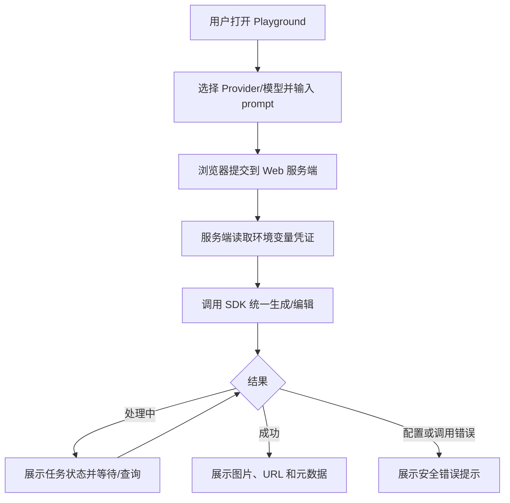

# 需求分支 PRD：SDK 体验与示例应用

## 0. 文档信息

- Sub ID：`SUB-005`
- 所属产品：AI Image SDK
- 总 PRD：`docs/prd/main-prd.md`
- Sub 目录：`docs/prd/sub-sdk-examples/`
- 文档版本：v1.1.0
- 文档状态：草稿
- UI 类型：混合型，包含 Node.js 示例和 Web Playground，生成 `ui.md`
- 来源说明：分支目标来自总 PRD；Web Playground 类型由本次需求澄清确认；当前 Web 仍是起始模板。

## 1. 分支目标

为 SDK 使用者提供可复制、可运行、可观察的体验入口：通过 `examples/*` 展示 Provider 配置和统一 API 调用，并提供一个服务端保护 API Key 的 Web Playground，用于选择 Provider/模型、输入 prompt、提交生成和查看结果。

## 2. 分支边界

### 2.1 本分支包含

- examples workspace 结构和运行说明。
- 各首批 Provider 的 `.env.example`。
- 阿里云百炼示例默认展示推荐模型选择：高质量使用 `wan2.7-image-pro`，平衡使用 `wan2.7-image`，快速低成本使用 `z-image-turbo`；编辑场景隐藏不支持编辑的模型。
- Node.js 服务端最小调用示例。
- 当前 Web 应用中的 Web Playground。
- Playground 的 prompt、Provider/model 选择、生成/编辑模式、加载、错误和结果展示。
- SDK API、Provider 能力和配置文档入口。

### 2.2 本分支不包含

- 管理控制台、用户系统、团队权限、账单和用量管理。
- 浏览器直接持有 Provider API Key。
- 生产级图片存储、历史记录和跨用户任务恢复。
- 自动 Provider fallback、智能路由和批量生成。
- 修改 SDK 核心 Provider/任务/错误契约；这些由其他 sub 负责。

### 2.3 与其他 Sub 的边界与协作

| 协作方 | 关系 |
|---|---|
| `SUB-001` | Playground 使用 Provider 工厂和模型实例；示例展示各 Provider 配置 |
| `SUB-002` | Playground 调用统一生成/编辑函数 |
| `SUB-003` | Playground 展示提交、处理中、完成和失败状态 |
| `SUB-004` | Playground 将安全、可理解的错误展示给用户 |

## 3. 用户角色

- 首次试用者：复制环境模板并通过 Playground 验证 Provider。
- Node.js 开发者：阅读 examples 并复制服务端代码。
- SDK 维护者：通过示例回归 Provider 契约和配置。

## 4. 核心业务流程

**目的**：表达用户通过 Web Playground 快速验证图像生成的完整流程。

**范围**：浏览器 UI、当前 Web 服务端边界和 SDK；不包含账号和持久化。

**图例**：浏览器、Next.js 服务端、SDK、Provider；API Key 只留在服务端环境。

**关键假设**：Playground 运行在开发/受控环境，不作为公共多租户服务。

ASCII 草图：

```text
[用户打开 Playground]
          |
          v
[选择 Provider/模型 + 输入 Prompt]
          |
          v
[Web 服务端读取 .env 密钥]
          |
          v
[SDK 统一生成/编辑]
      |             |
      v             v
 [处理中]       [配置/调用错误]
      |
      v
[展示图片、URL、元数据]
```

Mermaid：



**异常路径**：缺少环境变量、Provider 未配置、模型不支持编辑、任务超时和外部错误均展示可行动提示，不展示 token、堆栈或完整 Provider 响应。

**未覆盖范围**：用户登录、历史记录、对象存储、公共部署、浏览器直接调用 Provider。

**关联需求**：`US-009`；`FEAT-001` 至 `FEAT-006`。

## 5. 包含的功能模块

| 功能 ID | 功能名称 | 目录 | 优先级 | 说明 |
|---|---|---|---|---|
| `FEAT-001` | Examples workspace | `feat-examples-workspace` | P0 | 提供可运行的 Node.js 示例入口 |
| `FEAT-002` | Provider 环境模板 | `feat-provider-env-templates` | P0 | 为 Provider 提供 `.env.example` 和变量说明 |
| `FEAT-003` | Web Playground 请求入口 | `feat-playground-api` | P1 | 服务端安全调用 SDK |
| `FEAT-004` | Playground 生成表单 | `feat-playground-form` | P1 | Provider、模型、模式、prompt 和图片输入 |
| `FEAT-005` | Playground 任务与结果 | `feat-playground-result` | P1 | 状态、错误、图片、URL、元数据显示 |
| `FEAT-006` | SDK 使用文档与能力矩阵 | `feat-sdk-usage-docs` | P1 | 说明 API、配置和 Provider 差异 |

## 6. 用户故事

- `US-009`：首次试用者复制 `.env.example` 后可以运行 example。
- 作为开发者，我希望 Playground 不暴露 API Key，以便在受控环境快速验证 SDK。
- 作为 SDK 维护者，我希望每个 Provider 都有最小示例，便于回归适配器。

## 7. 分支级业务规则

- 浏览器不能提交 Provider API Key；所有 Provider 调用经过 Web 服务端。
- Playground 不保存 prompt、图片、任务和结果历史。
- 示例默认不得执行批量或高成本生成。
- Provider/model 选择必须对应已配置的环境变量和能力矩阵。
- 不支持编辑或输入类型时，提交前给出明确提示。
- UI 错误必须脱敏，服务端日志也不能记录凭证和图片内容。

## 8. 分支级数据与接口约定

- `.env.example` 只包含变量名、占位说明和可选/必填标识，不包含真实值。
- Playground 服务端入口接受 prompt、模式、Provider/model、图片输入引用和公开参数。
- 服务端不接受客户端 Provider Key；凭证来自服务端环境。
- 响应包含状态、结果图片引用、元数据或稳定错误 code/message。
- Playground 只展示远程 URL 或临时二进制预览，不承诺长期可访问。

## 9. 依赖与前置条件

- `SUB-001` 至少有一个可运行 Provider adapter（`@ai-media/provider-<name>`）。
- `SUB-002` 定义统一生成/编辑调用。
- `SUB-003` 定义任务状态和结果读取。
- 当前 Web 基于 Next.js 16.2.6、React 19.2.4、共享 `@workspace/ui`（shadcn 子目录约定）。
- `examples/*` 纳入根 workspaces；测试基线 `bun:test`。
- Web Playground 的具体 API 路由和图片上传策略需在实现阶段确认。

## 10. 分支验收标准

- [ ] 每个首批 Provider 有 `.env.example` 和最小 Node.js 示例。
- [ ] 阿里云百炼示例展示推荐模型和文生图/编辑能力差异，不把 `z-image-turbo` 展示为可编辑模型。
- [ ] Playground 不要求浏览器输入 API Key。
- [ ] 用户可选择 Provider/model、输入 prompt 并提交生成。
- [ ] UI 能展示加载、处理中、成功、失败和不支持能力状态。
- [ ] 成功结果可预览，并显示可用 URL/元数据。
- [ ] 错误提示不泄露凭证、堆栈和完整外部响应。
- [ ] examples 和 Playground 不引入长期存储或用户系统。

## 11. 待确认事项

- Playground 是仅供本地开发，还是部署到受控测试环境。
- 当前 Web 是否需要同时提供图生图文件上传。
- Playground 是否支持任务取消、历史结果和多图对比；默认不支持。
- Web 服务端临时图片输入的大小、格式和清理策略。
- 当前 Web 与未来文档站是否共用路由和设计系统。

## 12. 变更记录

| 版本 | 日期 | 变更内容 |
|---|---|---|
| v1.0.0 | 2026-07-30 | 根据总 PRD 和需求澄清创建 SDK 示例与 Web Playground 分支草稿。 |
| v1.1.0 | 2026-07-30 | 补充阿里云百炼推荐模型在 examples/Playground 中的选择和能力提示要求。 |
| v1.2.0 | 2026-07-30 | 登记 `examples/*` workspace、`bun:test`、`@ai-media/*` 包 scope。 |
