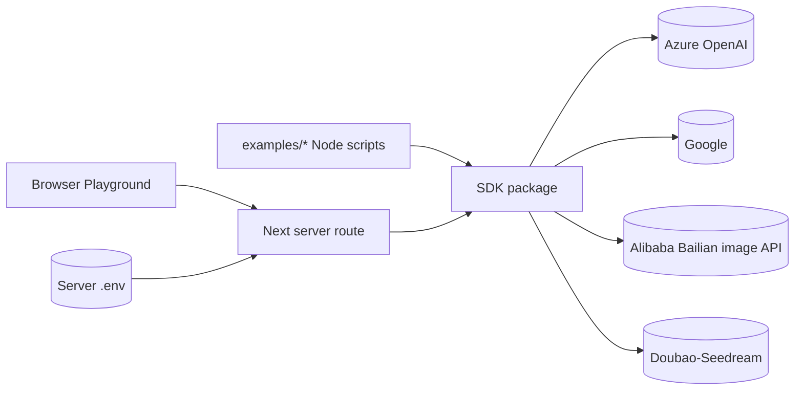
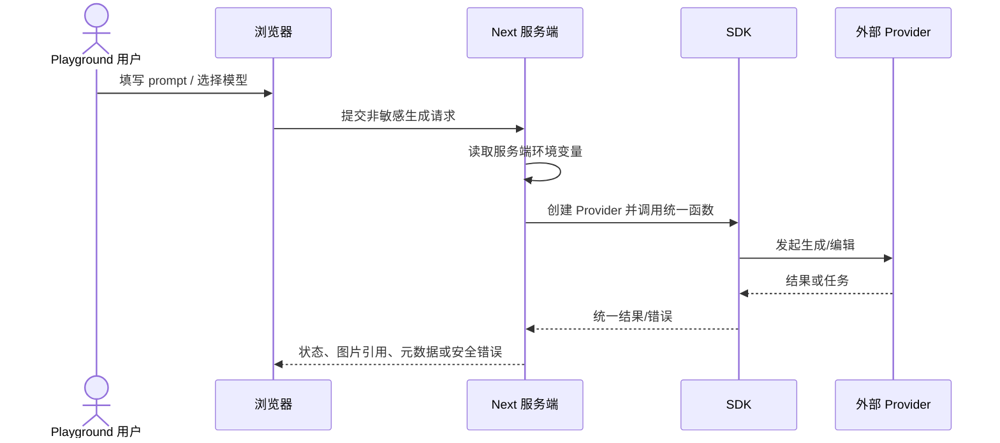
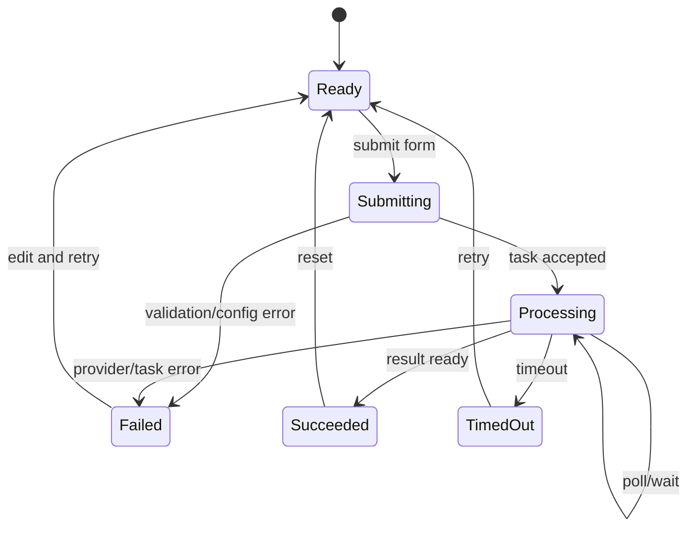
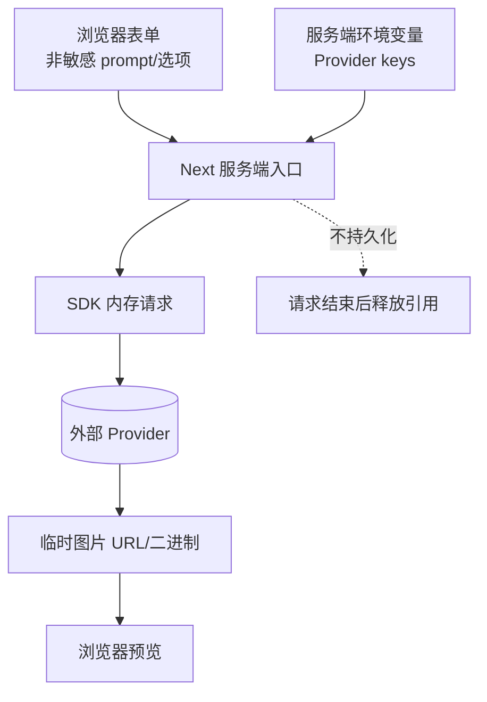

# 技术方案：SDK 体验与示例应用

## 0. 文档信息

- Sub：`SUB-005 SDK 体验与示例应用`
- 总 PRD：`docs/prd/main-prd.md`
- 对应需求文档：`./prd.md`
- 文档版本：v1.1.0
- 文档状态：草稿
- UI 类型：混合型

## 1. 代码库事实与复用点

当前仓库事实：

- `apps/web` 是 Next.js `16.2.6` 应用，使用 React `19.2.4`。
- `apps/web/app/page.tsx` 目前只有起始页和共享 Button，没有 Playground 功能。
- `apps/web/app/layout.tsx` 使用 `@workspace/ui/globals.css`、ThemeProvider、Inter/Geist 字体。
- `packages/ui` 提供共享 Button、Tailwind CSS v4 配置和 `@workspace/ui` 包。
- 当前 workspace 只有 `apps/*` 和 `packages/*`；`examples/*` 尚未存在。

因此 examples 和 Playground 属于新增结构，当前路径只能作为复用基线，不能视为已经存在的 API 或组件。

## 2. 技术架构

建议分两类入口：

- `examples/*`：Node.js 脚本/小应用，直接调用 SDK，按 Provider 提供环境模板。
- `apps/web` Playground：浏览器只调用 Web 服务端入口；服务端读取环境变量并调用 SDK。

Web 层不直接 import Provider secret，也不把 SDK Provider 实例暴露给客户端。图片输入首期可先支持服务端可读取的 URL/受限文件上传，具体策略待确认。

## 3. 模块架构图

**目的**：表达 examples、Playground、SDK 和外部 Provider 的边界。

**范围**：开发者体验 sub 的运行时边界。

**图例**：实线为请求，虚线为共享类型/文档关系；密钥只在服务端环境。

**假设**：Playground 为受控开发体验，不是公共多租户服务。

ASCII 草图：

```text
[Node examples] ------------------+
                                  |
[Browser Playground] -> [Next server route]
                                  |
                                  v
                         [SDK package]
                                  |
                  +---------------+---------------+
                  v               v               v
             [Azure]          [Google]       [Alibaba/Seedream]
```

Mermaid：



**异常路径**：客户端请求不完整返回安全 4xx；SDK/Provider 错误映射为稳定错误；服务端不把 `.env` 内容或堆栈返回浏览器。

**相关模块**：`FEAT-001` 至 `FEAT-006`、`SUB-001` 至 `SUB-004`。

## 4. 服务端请求流程



超时、错误和中止由 `SUB-003`/`SUB-004` 规则处理；Web 只做展示和用户可操作提示。

## 5. Playground 任务状态图

**目的**：定义 Playground 对 SDK 任务状态的展示边界。

**范围**：Web 服务端请求生命周期，不改变 `SUB-003` 的任务契约。

**图例**：终态由 SDK 返回；浏览器只展示状态。

**关键假设**：Playground 不持久化任务，页面刷新后的恢复能力待确认。



非法转换：未配置 Provider 不得进入提交；失败状态不得自动切换 Provider；成功结果不应在无用户操作时重复生成。

## 6. 数据流与安全



安全约束：

- API Key 仅从服务端环境读取，不进入浏览器 bundle、响应或日志。
- 阿里云百炼示例的模型选项和能力提示应来自 Provider 能力注册表，不在 Playground 中硬编码“所有模型都支持编辑”。
- prompt、图片和外部响应不默认落盘。
- 如果支持文件上传，必须限制大小/MIME/超时并清理临时文件。
- Playground 不能被误当作公共 SaaS；部署范围、访问控制和限流需确认。

## 7. 当前项目第三方依赖记录

| 依赖 | 当前版本/事实 | 来源 | 方案结论 |
|---|---|---|---|
| Next.js | `16.2.6` | `apps/web/package.json` | 复用现有 App Router；实现时需遵守仓库 Next 文档规则 |
| React | `19.2.4` | `apps/web/package.json` | 复用现有 React 运行时 |
| `@workspace/ui` | workspace package | `packages/ui` | 复用共享 Button、样式和主题 |
| AI SDK | 未安装 | 官方文档/Context7 | 只参考 Provider/图像调用风格，不作为核心运行时依赖 |

Next/React 当前版本来自代码库事实；本 sub 未新增第三方依赖。若实现引入文件上传、表单校验或图片处理库，必须另行完成 Context7 查询并记录版本。

## 8. 测试策略

- examples smoke test：缺失 env、有效 env、Provider 选择和安全错误。
- 服务端 route 测试：输入校验、密钥不出现在响应、SDK mock、错误映射。
- Playground UI 测试：表单、禁用状态、处理中、成功、失败、空状态和响应式布局。
- Contract test：Web route 调用 `SUB-002`/`SUB-003`/`SUB-004` 的公开接口。
- 不进行真实高成本模型调用作为默认 CI 测试；真实 Provider 测试需显式环境开关。

## 9. 备选方案

- 方案 A：仅 Node.js examples。成本最低，但无法直观看到任务和结果。
- 方案 B：当前 Web 增加受控 Playground，服务端代理 SDK。体验更完整，但需处理密钥、上传和部署安全。
- 方案 C：建设公共文档站/管理控制台。范围过大，包含账户、权限和存储问题。
- 选择：方案 B，且保留 Playground 仅作为受控示例，不定义为平台产品。

## 10. 发布、兼容与回滚

- examples 与 SDK package 版本保持可追踪，env 模板随 Provider 变更更新。
- Playground API 只作为内部示例契约，不承诺对外稳定版本。
- 若某 Provider 配置不可用，UI 显示未配置/不可用，不影响其他 examples。
- Web 变更可独立回滚，不影响 SDK package 公共契约。

## 11. 风险与待确认

- 总 PRD 当前曾将 Web Playground列为非目标，本次澄清已改为本 sub 的明确范围，需要回写总 PRD 保持一致。
- Next.js 服务端如何处理图片上传、URL 下载和临时文件待确认。
- Playground 是否需要本地访问控制和部署限流待确认。
- 当前共享 UI 组件很少，需要避免在 sub 级文档中假定不存在的组件。

## 12. 变更记录

| 版本 | 日期 | 变更内容 |
|---|---|---|
| v1.0.0 | 2026-07-30 | 创建 examples 与 Web Playground 技术方案。 |
| v1.1.0 | 2026-07-30 | 补充百炼模型能力注册表在 examples/Playground 中的消费约束。 |
