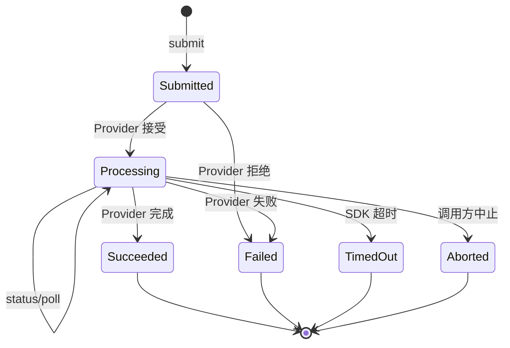

# 需求分支 PRD：异步任务与结果契约

## 0. 文档信息

- Sub ID：`SUB-003`
- 所属产品：AI Image SDK
- 总 PRD：`docs/prd/main-prd.md`
- Sub 目录：`docs/prd/sub-task-result-contract/`
- 文档版本：v1.0.0
- 文档状态：草稿
- UI 类型：纯后端型，不生成 `ui.md`
- 来源说明：进程内任务和结果边界来自总 PRD；具体状态需根据 Provider 能力确认。

## 1. 分支目标

统一同步/异步图像请求的任务句柄、状态查询、等待完成和结果读取方式，使调用方不必理解每个 Provider 的轮询协议，同时明确首期不提供跨进程持久化、Webhook 和长期存储。

## 2. 分支边界

### 2.1 本分支包含

- 进程内任务句柄。
- 提交、查询、等待和结果读取。
- Provider 状态映射。
- 任务超时、中止和不可取消标记。
- 图片 URL、二进制内容和元数据的统一结果。

### 2.2 本分支不包含

- Provider 请求转换，由 `SUB-001` 负责。
- 公共生成参数，由 `SUB-002` 负责。
- 错误分类和通用重试策略，由 `SUB-004` 负责。
- 数据库、Redis、Webhook、消息队列和跨进程恢复。
- 图片长期存储和 URL 续期。

### 2.3 与其他 Sub 的边界与协作

| 协作方 | 关系 |
|---|---|
| `SUB-001` | 提供任务提交、状态查询和结果获取适配能力 |
| `SUB-002` | 将统一生成/编辑调用交给任务契约 |
| `SUB-004` | 提供任务失败、超时和可重试错误分类 |
| `SUB-005` | Playground 展示任务状态和最终结果 |

## 3. 用户角色

- Node.js 后端开发者：等待结果或主动查询任务。
- Playground 用户：看到处理中、成功和失败状态。
- SDK 维护者：适配不同 Provider 的任务生命周期。

## 4. 核心业务流程

**目的**：表达任务从创建到完成、失败或超时的生命周期。

**范围**：当前进程内任务；不表达持久化恢复。

**图例**：提交方、任务注册表、Provider 查询、结果读取；虚线为轮询。

**关键假设**：任务句柄只在创建它的进程内有效。

ASCII 草图：

```text
[提交请求] -> [创建任务句柄] -> [处理中]
                                  |
                         +--------+--------+
                         v        v        v
                      [完成]   [失败]   [超时/中止]
                         |
                         v
                 [读取图片与元数据]
```

Mermaid：



**异常路径**：进程重启导致句柄失效、Provider 返回未知状态、结果 URL 过期、任务查询超时均转为明确任务或 Provider 错误，不伪装为成功。

**未覆盖范围**：跨进程恢复、Webhook、任务队列持久化。

**关联需求**：`US-005`、`US-006`；`FEAT-001` 至 `FEAT-004`。

## 5. 包含的功能模块

| 功能 ID | 功能名称 | 目录 | 优先级 | 说明 |
|---|---|---|---|---|
| `FEAT-001` | 任务提交与句柄 | `feat-task-handle` | P0 | 创建进程内任务并返回稳定标识 |
| `FEAT-002` | 状态查询与等待 | `feat-task-observation` | P0 | 查询状态、轮询和等待完成 |
| `FEAT-003` | 任务状态映射 | `feat-task-status` | P0 | 映射不同 Provider 的状态 |
| `FEAT-004` | 统一图片结果 | `feat-image-result` | P0 | 读取二进制、URL 和元数据 |
| `FEAT-005` | 超时与中止 | `feat-task-timeout` | P1 | 支持超时、AbortSignal 和不可取消声明 |

## 6. 用户故事

- `US-005`：调用方获得统一图片、URL 和元数据。
- `US-006`：调用方可以等待或查询异步任务。

## 7. 分支级业务规则

- 任务句柄为模态无关泛型 `TaskHandle<TContent>`；MVP 实例化为 `TaskHandle<ImageContent>`，后续视频/音频复用同结构。
- 任务至少区分提交、处理中、成功、失败、超时和中止/不可取消状态。
- 同步 Provider（如 Azure OpenAI 图像 API）直接映射为 `Succeeded` 结果，无需轮询；异步 Provider（如阿里云 DashScope `async_call`→`wait`）映射为 `Submitted`→`Processing`→`Succeeded`/`Failed` 轮询状态。
- 任务句柄不承诺进程重启后仍有效。
- 任务完成后图片 URL 的有效期由 Provider 或调用方负责。
- 任务结果不得隐式写入数据库、对象存储或日志。

## 8. 分支级数据与接口约定

- 任务句柄包含本地任务 ID、Provider 标识、模型标识和非敏感外部任务 ID。
- 状态查询返回标准状态、更新时间、进度（若 Provider 支持）和错误引用。
- 结果包含图片读取能力、远程 URL（若有）、MIME、尺寸、Provider 元数据和任务标识。
- 轮询间隔、最大等待时长和中止信号必须可配置或有明确默认值。

## 9. 依赖与前置条件

- `SUB-001` 必须提供 Provider 任务操作或同步完成标识。
- `SUB-002` 提供统一生成/编辑请求。
- `SUB-004` 提供超时、任务失败和重试分类。
- 不同 Provider 是否支持取消和进度需要接入时确认。

## 10. 分支验收标准

- [ ] 同步结果和异步任务都能返回统一结果。
- [ ] 任务状态映射不暴露 Provider 私有状态名作为唯一公共契约。
- [ ] 调用方可以查询和等待任务。
- [ ] 超时不会无限轮询或把任务误报为成功。
- [ ] 进程重启后任务失效行为有明确错误。
- [ ] 结果读取不默认长期保存图片。

## 11. 待确认事项

- 是否公开 `submit`、`status`、`wait`、`result` 四类低层 API。
- 默认轮询间隔、最大等待时间和最大任务数。
- 是否支持 `AbortSignal` 作为首期 API。
- 任务完成后是否缓存二进制，及缓存的内存上限。
- Provider 返回 URL 过期后是否允许重新获取结果。

## 12. 变更记录

| 版本 | 日期 | 变更内容 |
|---|---|---|
| v1.0.0 | 2026-07-30 | 根据总 PRD 创建异步任务与结果契约分支草稿。 |
| v1.1.0 | 2026-07-30 | `TaskHandle<TContent>` 模态无关泛型化；明确 Azure 同步直映 Succeeded、阿里云 DashScope 异步 submit→poll 映射。 |
