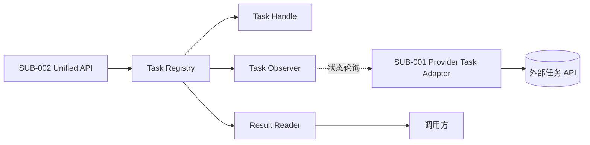
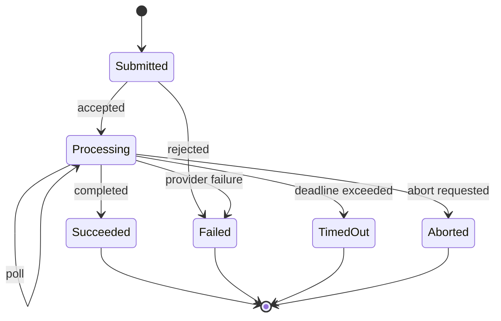
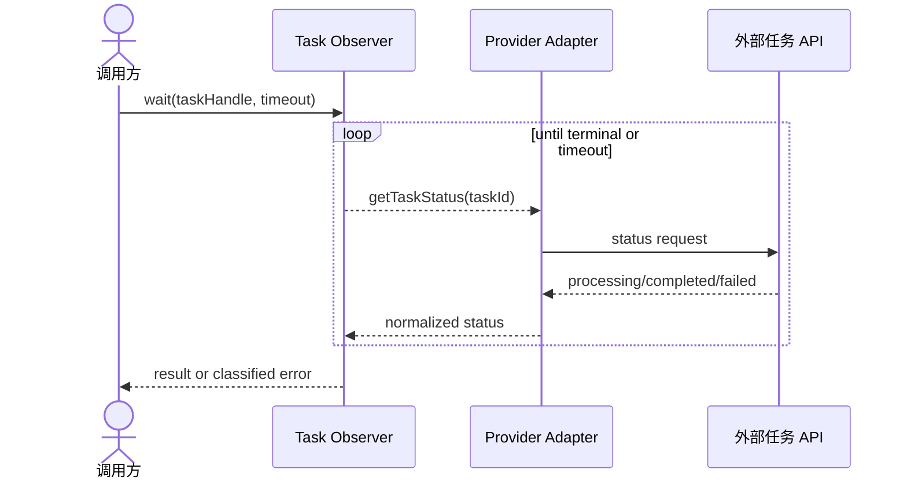
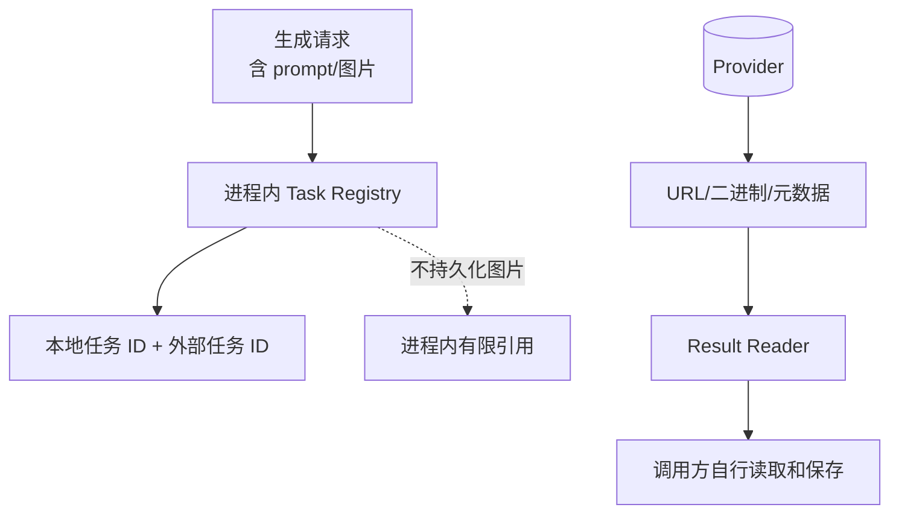

# 技术方案：异步任务与结果契约

## 0. 文档信息

- Sub：`SUB-003 异步任务与结果契约`
- 总 PRD：`docs/prd/main-prd.md`
- 对应需求文档：`./prd.md`
- 文档版本：v1.0.0
- 文档状态：草稿

## 1. 代码库事实与边界

仓库当前没有任务队列、数据库、缓存或 SDK 运行时代码。根工程要求 Node.js `>=20`，适合使用原生 `AbortSignal`、Promise 和异步迭代等能力，但具体 API 需在 feat 级方案确认。本 sub 明确采用进程内状态，不新增持久化依赖。

## 2. 技术架构

- `TaskHandle`：对外暴露稳定任务标识和 Provider/模型上下文。
- `TaskRegistry`：进程内保存任务状态和有限结果引用。
- `TaskObserver`：负责查询、等待、轮询间隔和超时。
- `ResultReader`：按需读取 URL、Buffer/Blob 和元数据。
- `ProviderTaskAdapter`：由 `SUB-001` 实现外部状态转换。

结果读取默认不写磁盘或对象存储；是否缓存二进制需由实现阶段确定。

## 3. 模块架构图

**目的**：表达任务 sub 的内部模块、Provider 边界和调用方边界。

**范围**：进程内任务生命周期。

**图例**：实线为同步调用，虚线为 Provider 状态轮询。

**假设**：任务重启恢复不在 MVP。

ASCII 草图：

```text
[SUB-002 统一 API] -> [Task Registry] -> [Task Observer]
                            |                 |
                            v                 v
                      [Task Handle]    [SUB-001 Adapter]
                                                  |
                                                  v
                                         [外部任务 API]
                            |
                            v
                       [Result Reader] -> [调用方]
```

Mermaid：



**异常路径**：未知状态、查询超时、进程重启或结果读取失败进入 `SUB-004` 的任务/Provider 错误。

**关联模块**：`FEAT-001` 至 `FEAT-005`、`SUB-001`、`SUB-002`、`SUB-004`。

## 4. 状态图

**目的**：定义任务状态和非法转换。

**范围**：MVP 进程内任务。

**图例**：终态为成功、失败、超时和中止；取消能力按 Provider 声明。

**假设**：任务状态不会在终态后回退。

ASCII 草图：

```text
[创建] -> [已提交] -> [处理中] -> [成功]
                         |  \-> [失败]
                         |  \-> [超时]
                         \----> [中止]
```

Mermaid：



非法转换示例：成功后不得回到处理中；进程重启后的本地句柄不得伪造为处理中；不支持取消的 Provider 不得转为已取消。

## 5. 时序图

**目的**：表达 `wait` 的查询、退避和终态返回。

**范围**：外部 Provider 返回异步任务 ID。

**参与者**：调用方、Task Observer、Provider Adapter、外部 API。

**假设**：轮询策略有最大等待时间。

ASCII 草图：

```text
[调用方] -> [wait] -> [Task Observer] - -查询- -> [Adapter] -> [Provider]
             ^             |                         |
             |             +< -处理中/完成/失败 - - -+
             +---------- 终态结果或错误
```

Mermaid：



## 6. 数据流与安全

**目的**：表达任务元数据和图片结果的内存边界。

**范围**：进程内，不含长期存储。



敏感图片和 prompt 不进入普通日志；任务 ID 可记录但需避免与秘密凭证同日志。结果缓存上限、清理策略和 URL 下载安全需在实现前确认。

## 7. 测试策略

- 状态机单元测试：合法/非法转换和终态不可回退。
- Observer 测试：处理中轮询、成功、失败、超时和 AbortSignal。
- Provider contract mock：同步响应、异步任务和未知状态。
- 内存清理测试：任务完成、失败、超时后引用释放。
- 进程重启语义测试：旧句柄返回明确失效错误。

## 8. 依赖与方案依据

- 只依赖 TypeScript、Node.js 原生异步能力和 `SUB-001` Provider contract。
- 不引入 Redis、数据库、消息队列或 Webhook 依赖。
- 当前项目尚无任务相关第三方依赖，无需新增 Context7 依赖查询。

## 9. 备选方案

- 方案 A：只暴露 `await generateImage`。简单，但无法表达长任务查询和 Playground 进度。
- 方案 B：进程内任务句柄 + `wait/status/result`。满足总 PRD，同时不引入服务端基础设施。
- 方案 C：Redis/数据库持久化。可恢复但超出 SDK MVP 和纯客户端信任边界。
- 选择：方案 B。

## 10. 发布、兼容与回滚

- 任务状态枚举、结果字段和句柄结构在 alpha 阶段记录版本。
- 增加可选结果字段优先；状态语义变更需版本评审。
- 若某 Provider 不支持查询或取消，能力声明必须反映限制，不能用模拟状态掩盖。

## 11. 风险与待确认

- 不同 Provider 的任务状态和 URL 有效期差异较大。
- 大图片 Buffer 缓存可能造成内存压力。
- 取消能力、任务恢复和结果重新获取待首批 Provider 验证。

## 12. 变更记录

| 版本 | 日期 | 变更内容 |
|---|---|---|
| v1.0.0 | 2026-07-30 | 创建异步任务与结果契约技术方案。 |
