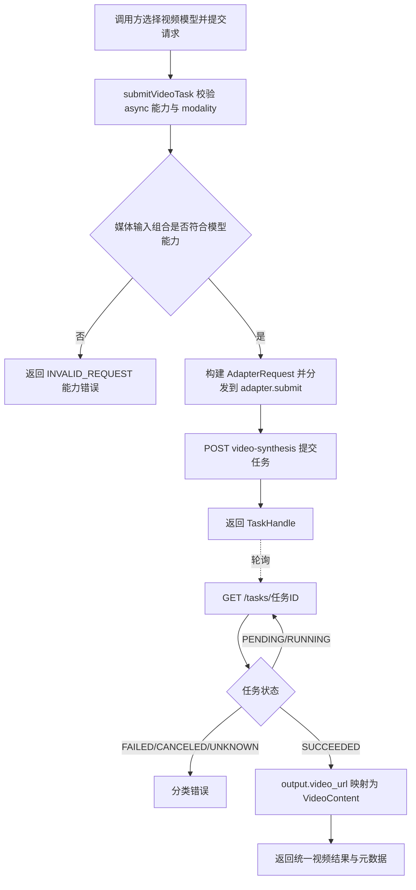

# 需求分支 PRD：视频生成

## 0. 文档信息

- Sub ID：`SUB-006`
- 所属产品：AI Media SDK
- 总 PRD：`docs/prd/main-prd.md`
- Sub 目录：`docs/prd/sub-video-generation/`
- 文档版本：v1.0.0
- 文档状态：草稿
- UI 类型：纯后端型，不生成 `ui.md`
- 来源说明：调用入口与任务生命周期来自总 PRD SUB-006；HappyHorse 四个模型（t2v/i2v/r2v/video-edit）的 live 契约来自阿里云百炼官方 HTTP 调用文档（用户提供，核对日期 2026-08-04）；已实现代码事实来自 Phase 4（核心异步契约 + t2v/i2v 适配器）。Wan 视频系列已过时，本分支不推进。

## 1. 分支目标

定义跨 Provider 的视频生成与视频编辑统一调用入口（`submitVideoTask`）与任务生命周期契约，让调用方用同一函数提交文生视频（t2v）、首帧图生视频（i2v）、参考生视频（r2v）和视频编辑（video-edit）任务，通过统一任务句柄等待并读取视频结果，同时通过 `providerOptions` 保留 Provider 独有能力。

## 2. 分支边界

### 2.1 本分支包含

- 统一视频任务提交入口 `submitVideoTask` 的调用语义。
- 扩展的 `VideoGenerationRequest` / `VideoGenerationInput` 公共契约：`prompt` + 可选 `firstFrame`（i2v）+ 可选 `referenceImages`（r2v/video-edit）+ 可选 `inputVideo`（video-edit）+ `providerOptions`。
- 四种视频模式的公共输入组合规则与按模型能力校验。
- `VideoContent` 结果契约（URL、MIME、时长等元数据）。
- 视频任务生命周期：提交 → 轮询 → 完成/失败（复用 `SUB-003` 异步任务契约）。
- `providerOptions.aliyun` 下视频原生参数的透传边界（`resolution`/`ratio`/`duration`/`watermark`/`seed`/`audio_setting`）。

### 2.2 本分支不包含

- Provider 认证、endpoint 拼接和平台请求转换，由 `SUB-001` 负责。
- 进程内任务句柄、轮询和等待实现，由 `SUB-003` 负责（Phase 4 已实现）。
- 全局错误分类和重试策略，由 `SUB-004` 负责。
- 视频长期存储、内容审核和 Webhook。
- Wan 视频系列（`wan2.7-t2v`/`wan2.7-i2v`/`wan2.7-r2v`）：官方资料已过时，本分支不推进；如后续需要，单独建切片。
- `animate-*` 系列、流式输出、视频任务批量查询与取消。

### 2.3 与其他 Sub 的边界与协作

| 协作方    | 关系                                                                   |
| --------- | ---------------------------------------------------------------------- |
| `SUB-001` | 提供视频模型实例、能力声明（媒体输入需求）和 Provider 适配入口          |
| `SUB-003` | 承接异步任务提交结果，提供统一任务句柄、轮询和等待                      |
| `SUB-004` | 校验公共输入、能力冲突并映射错误                                        |
| `SUB-005` | Playground 视频模式、示例与文档消费公共入口                             |

## 3. 用户角色

- Node.js 后端开发者：用统一函数提交视频任务并等待结果。
- AI 应用开发者：按模型能力组合 prompt、首帧、参考图和输入视频。
- SDK 维护者：新增视频模型时不修改统一调用契约。

## 4. 核心业务流程

**目的**：表达四种视频模式从统一入口到获得视频结果的主路径及媒体输入组合差异。

**范围**：一次视频生成/编辑请求；异步轮询复用 `SUB-003`。

**参与者/图例**：调用方、统一 SDK（`submitVideoTask`）、能力校验、Provider 适配器、外部视频平台；虚线表示轮询。

**关键假设**：调用方已提供目标 Provider 的 API Key；各模型的媒体输入需求由能力声明决定。

ASCII 草图：

```text
[调用方]
    |
    | 选择模型 + prompt + 可选媒体输入
    v
[submitVideoTask] --> [能力校验]
    |                     |
    |                     +--> 缺少必传媒体 / 组合冲突: 返回 INVALID_REQUEST
    v
[Provider 适配器]
    |
    | t2v: input={prompt}
    | i2v: input={prompt?, media:[first_frame]}
    | r2v: input={prompt, media:[reference_image ×1-9]}
    | video-edit: input={prompt, media:[video, reference_image ×0-5]}
    v
[POST video-synthesis (X-DashScope-Async)] --> [task_id]
    |
    v
[TaskHandle.wait()] --轮询--> [GET /tasks/{task_id}]
    |
    v
[VideoContent[]: url + 元数据]
```

Mermaid：



**异常路径**：

- API Key 缺失或无效：返回认证错误，不重试。
- 空 prompt、缺必传媒体输入、媒体数量超出模型上限：返回 `INVALID_REQUEST`，不发起外部调用。
- 限流、网络暂时不可用或请求超时：按重试策略有限重试，耗尽后返回可识别错误。
- 任务失败：保留 Provider 错误上下文（`output.code`/`output.message`），对外返回脱敏后的稳定错误。

**未覆盖范围**：Webhook、长期任务恢复、跨进程查询、视频长期存储、`[Image N]` 指代的内容级校验（SDK 不解析 prompt 指代，仅透传）。

**相关需求**：`US-005`、`US-006`；总 PRD `SUB-006`。

## 5. 包含的功能模块

功能目录由 `/oc-prd-feat` 后续创建；本次只在 sub PRD 中登记，不创建 `feat-*` 目录。

| 功能 ID    | 功能名称             | 目录                      | 优先级 | 说明                                                                   |
| ---------- | -------------------- | ------------------------- | ------ | ---------------------------------------------------------------------- |
| `FEAT-001` | 视频任务提交入口     | `feat-video-submit`       | P0     | `submitVideoTask` 统一入口，能力校验与分发（Phase 4 已实现）            |
| `FEAT-002` | 文生视频（t2v）      | `feat-text-to-video`      | P0     | 纯 prompt 输入（已实现：`happyhorse-1.1-t2v`）                          |
| `FEAT-003` | 首帧图生视频（i2v）  | `feat-image-to-video`     | P0     | `firstFrame` 单图输入（已实现：`happyhorse-1.1-i2v`）                   |
| `FEAT-004` | 参考生视频（r2v）    | `feat-reference-to-video` | P0     | `referenceImages` 1-9 图输入，契约已确认待实现（`happyhorse-1.1-r2v`） |
| `FEAT-005` | 视频编辑（video-edit） | `feat-video-edit`       | P0     | `inputVideo` + 0-5 参考图输入，契约已确认待实现（`happyhorse-1.0-video-edit`） |
| `FEAT-006` | 视频结果契约         | `feat-video-result`       | P0     | `VideoContent` 类型与结果映射（已实现）                                 |

## 6. 用户故事

- 作为调用方，我希望用统一函数提交文生视频任务，以便获得 `VideoContent[]` 结果。
- 作为调用方，我希望传入首帧图片生成视频（i2v），以便从静态图延展动态内容。
- 作为调用方，我希望传入 1-9 张参考图并在 prompt 中用 `[Image N]` 指代（r2v），以便将多主体融合进一段视频。
- 作为调用方，我希望传入一段视频和可选参考图完成风格变换或局部替换（video-edit），以便编辑已有视频。
- 作为调用方，我希望通过 `providerOptions.aliyun` 控制分辨率、宽高比、时长、水印、随机种子和声音设置，以便保留平台独有能力。

## 7. 分支级业务规则

- 任务句柄复用模态无关泛型 `TaskHandle<VideoContent[]>`；视频任务为异步，模型必须声明 `async: true` 且 `modality: "video"`。
- 媒体输入组合按模型能力校验，**不兼容的组合在请求前报错，不得静默忽略**：
  - t2v：不接受 `firstFrame`/`referenceImages`/`inputVideo` 任何媒体输入。
  - i2v：必须恰好一个 `firstFrame`；不接受 `referenceImages`/`inputVideo`；`prompt` 可空。
  - r2v：必须 `referenceImages`（1-9 张）；不接受 `firstFrame`/`inputVideo`；`prompt` 必选。
  - video-edit：必须恰好一个 `inputVideo`；可选 `referenceImages`（0-5 张）；不接受 `firstFrame`；`prompt` 必选。
- `prompt` 在 t2v/r2v/video-edit 模式下必填（i2v 可空）；t2v 模式空 prompt 在请求前报 `INVALID_REQUEST`。
- `ratio` 仅 t2v/r2v 支持；i2v 宽高比跟随首帧、video-edit 宽高比跟随输入视频，均不转发 `ratio`。
- `duration` 仅 t2v/i2v/r2v 支持（3-15 秒整数）；video-edit 输出时长由输入视频决定（≤15s 与输入一致，>15s 截取前 15 秒），不转发 `duration`。
- `resolution` 四模式均支持；video-edit 可选值仅 `720P`/`1080P`（无 `480P`）。
- `audio_setting`（`auto`/`origin`）仅 video-edit 支持，经 `providerOptions.aliyun` 透传。
- r2v 的 `[Image N]` 指代由 prompt 文本承载，SDK 不解析指代内容，仅保证 `referenceImages` 数组顺序与 prompt 指代一致地透传。
- SDK 不负责视频长期存储；`video_url` 有效期 24 小时，由调用方负责转存。
- 不承诺跨 Provider 视频能力完全一致；不支持的能力显式报错。

## 8. 分支级数据与接口约定

### 8.1 公共请求契约

```ts
interface VideoGenerationRequest {
  readonly model: VideoModelInstance;
  readonly prompt: string;
  readonly firstFrame?: ImageContent;                    // i2v
  readonly referenceImages?: readonly ImageContent[];    // r2v / video-edit
  readonly inputVideo?: VideoContent | { url: string };  // video-edit
  readonly providerOptions?: Readonly<Record<string, unknown>>;
}
```

`VideoGenerationInput` 为去掉 `model` 后的适配器载荷，由核心入口构建并放入 `AdapterRequest.input`。

### 8.2 结果契约

- `VideoContent`：`url`（必选）+ 可选 `mimeType`/`duration`/`width`/`height`。
- `GenerationResult<VideoContent[]>`：视频结果固定为单元素数组（DashScope `video_count` 固定 1），但保留数组形态与核心泛型一致。
- `raw` 携带非敏感 `usage`（`duration`/`SR`/`ratio`/`input_video_duration`/`output_video_duration`/`video_count`）供诊断。
- `requestId` 携带 Provider `request_id`。

### 8.3 媒体输入映射

- `ImageContent`（firstFrame/referenceImages）→ `media[].url`：URL 直接使用；base64 映射为 `data:{MIME};base64,{base64}`。
- `inputVideo` → `media[0].url`：视频必须为公网 URL（HTTP/HTTPS）；DashScope 视频编辑**不支持 base64 视频输入**。
- `media[].type` 由适配器按模式生成：`first_frame` / `reference_image` / `video`，调用方不直接书写 type。

### 8.4 Provider 原生参数（`providerOptions.aliyun`）

| 参数            | t2v | i2v | r2v | video-edit | 取值                                              |
| --------------- | --- | --- | --- | ---------- | ------------------------------------------------- |
| `resolution`    | ✓   | ✓   | ✓   | ✓          | `480P`/`720P`/`1080P`（video-edit 无 `480P`）     |
| `ratio`         | ✓   | ✗   | ✓   | ✗          | `16:9`/`9:16`/`1:1`/`4:3`/`3:4`/`4:5`/`5:4`/`9:21`/`21:9` |
| `duration`      | ✓   | ✓   | ✓   | ✗          | 3-15 整数秒                                        |
| `watermark`     | ✓   | ✓   | ✓   | ✓          | 布尔，默认 `true`                                  |
| `seed`          | ✓   | ✓   | ✓   | ✓          | `[0, 2147483647]`                                  |
| `audio_setting` | ✗   | ✗   | ✗   | ✓          | `auto`（默认）/`origin`                            |

### 8.5 媒体素材限制（来自 live 契约，SDK 层按需预校验）

- 首帧/参考图（i2v/r2v/video-edit）：JPEG/JPG/PNG/WEBP；宽高不小于 300px（r2v 建议短边不低于 400px）；宽高比 1:2.5～2.5:1；单文件不超过 20MB。
- 输入视频（video-edit）：MP4/MOV（建议 H.264）；3-60 秒；长边不超过 4096px、短边不小于 360px；宽高比 1:2.5～2.5:1；不超过 100MB；帧率大于 8fps；仅公网 URL。
- prompt：不超过 5000 个非中文字符或 2500 个中文字符，超出由 Provider 截断。

## 9. 依赖与前置条件

- `SUB-001` 提供视频模型实例与能力声明（媒体输入需求：`requiresFirstFrame`/`requiresInputVideo`/`maxReferenceImages`）。
- `SUB-003` 提供 `TaskHandle<TContent>` / `createTaskHandle` / `submitTask<TContent>` 异步任务契约（Phase 4 已实现）。
- `SUB-004` 提供错误分类（`INVALID_REQUEST`/`AUTH_ERROR`/`RATE_LIMITED`/`PROVIDER_ERROR`/`TIMEOUT` 等）。
- 阿里云百炼视频 live 契约已确认（2026-08-04，详见 `sub-provider-adapters/tech.md` §4.5 与本 sub `tech.md`）。

## 10. 分支验收标准

- [ ] t2v/i2v/r2v/video-edit 四种模式均能通过 `submitVideoTask` 提交并获得 `TaskHandle<VideoContent[]>`。
- [ ] 缺少必传媒体输入（i2v 缺 `firstFrame`、r2v 缺 `referenceImages`、video-edit 缺 `inputVideo`）在请求前返回 `INVALID_REQUEST`。
- [ ] 媒体数量超限（r2v >9 参考图、video-edit >5 参考图）在请求前返回 `INVALID_REQUEST`。
- [ ] 不兼容的媒体组合（t2v 带媒体、i2v 带 `referenceImages` 等）在请求前返回 `INVALID_REQUEST`。
- [ ] i2v/video-edit 请求体不携带 `ratio`；video-edit 请求体不携带 `duration`。
- [ ] `audio_setting` 仅在 video-edit 模式透传。
- [ ] 异步轮询复用共享 `getTask`，状态映射与图像异步一致。
- [ ] `SUCCEEDED` 时 `output.video_url` 映射为单元素 `VideoContent[]`，`raw` 携带非敏感 `usage`。

## 11. 待确认事项

- r2v 的 `[Image N]` prompt 指代是否需要 SDK 层做语义校验（当前设计：不解析，仅透传）。
- video-edit 输入视频的时长/分辨率/大小/帧率限制是否在 SDK 层预校验，还是交由 Provider 拒绝后错误分类（当前设计：可选项，首期交由 Provider）。
- `inputVideo` 的类型是否收敛为 `{ url: string }`（当前设计：`VideoContent | { url: string }` 二选一，实现阶段可收敛）。
- 视频任务取消（DashScope 管理异步任务 API）是否后续切片提供。
- Wan 视频系列已过时，不推进；如官方资料更新，单独评估。

## 12. 变更记录

| 版本   | 日期       | 变更内容                                                                                                                                |
| ------ | ---------- | --------------------------------------------------------------------------------------------------------------------------------------- |
| v1.0.0 | 2026-08-04 | 创建视频生成分支 PRD：登记 t2v/i2v（已实现）与 r2v/video-edit（契约已确认待实现）四模式；方案 A 扩展 `VideoGenerationInput`；登记媒体限制矩阵。 |
