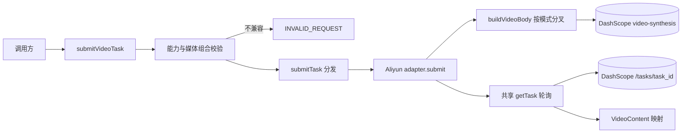
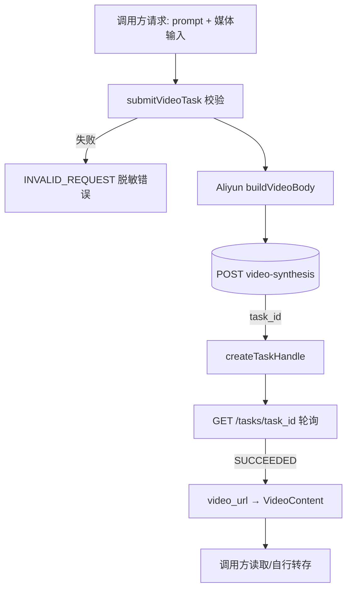

# 技术方案：视频生成

## 0. 文档信息

- Sub：`SUB-006 视频生成`
- 总 PRD：`docs/prd/main-prd.md`
- 对应需求文档：`./prd.md`
- 文档版本：v1.0.0
- 文档状态：草稿
- 方案性质：复用 Phase 4 核心模态无关异步契约；Provider 适配器纯 fetch，不包装官方 SDK

## 1. 代码库事实与复用点

**Phase 4 已实现（可直接复用）**：

- 核心入口 `submitVideoTask(request)`：`packages/ai-media-sdk/src/video/submit.ts`，校验 `async` 能力 → `video` modality → 非空 prompt，构建 `VideoGenerationInput` 后经 `submitTask<VideoContent[]>` 分发到 `model.adapter.submit()`。
- 公共契约 `VideoGenerationRequest` / `VideoGenerationInput` / `VideoModelInstance`：`packages/ai-media-sdk/src/video/request.ts`，当前仅 `prompt` + `firstFrame?` + `providerOptions?`。
- `VideoContent` 类型：`packages/ai-media-sdk/src/contracts/content.ts`（`url` + 可选 `mimeType`/`duration`/`width`/`height`）。
- 核心异步机制：`submitTask<TContent>`（`packages/ai-media-sdk/src/async/submit-task.ts`）与 `createTaskHandle`（`packages/ai-media-sdk/src/async/create-task-handle.ts`），模态无关。
- Aliyun HappyHorse t2v/i2v 适配器：`packages/provider-aliyun-bailian/src/provider/index.ts` 的 `submit()` 分支（`happyhorse-video` family），共享 `getTask(taskId)` 轮询（`GET /tasks/{task_id}` + `mapTaskStatus`）。
- 模型注册表：`packages/provider-aliyun-bailian/src/provider/registry.ts`，`happyhorse-1.1-t2v`/`happyhorse-1.1-i2v` 已注册，`requiresFirstFrame` 字段表达 i2v 首帧需求。
- 契约测试：`packages/provider-aliyun-bailian/tests/aliyun-video-adapter.test.ts`（fake transport）+ `packages/ai-media-sdk/tests/async-task.test.ts`（核心分发）。
- 示例 `examples/aliyun-video/` 与 Playground 视频模式（`apps/web/components/playground/index.tsx`）。

**本切片（r2v + video-edit）需要扩展**：

- `VideoGenerationRequest` / `VideoGenerationInput` 增加 `referenceImages?` 与 `inputVideo?` 可选字段（方案 A，见 §4）。
- Aliyun 注册表增加 `happyhorse-1.1-r2v` / `happyhorse-1.0-video-edit` 条目及媒体需求字段。
- 适配器 `buildVideoBody` 按模型媒体需求分叉 media 构建。
- 契约测试覆盖 r2v/video-edit 请求体、能力 gating 和错误分类。

## 2. 技术架构

```text
[调用方]
    |
    v
submitVideoTask(request)                    // 核心入口，模态校验 + 媒体组合校验
    |
    v
submitTask<VideoContent[]>(AdapterRequest)  // Phase 4 模态无关分发
    |
    v
Aliyun adapter.submit()                     // happyhorse-video family 分支
    |
    +--> buildVideoBody(input, entry)       // 按模型媒体需求分叉（§5）
    |
    v
POST {baseUrl}/services/aigc/video-generation/video-synthesis
    X-DashScope-Async: enable
    |
    v
task_id --> createTaskHandle({ taskId, poll })
    |
    v
poll: GET {baseUrl}/tasks/{task_id}         // 共享 getTask，与图像异步共用
    |
    v
SUCCEEDED --> output.video_url --> VideoContent[]（单元素）
```

四模式共用同一提交端点、同一异步头、同一轮询端点、同一状态机；**唯一差异在 `input` 与 `parameters` 的构建**。因此不需要新的适配器分支 family，扩展 `happyhorse-video` 的 `buildVideoBody` 即可。

## 3. 模块架构图



## 4. 核心契约扩展（方案 A）

保持单入口 `submitVideoTask`，扩展公共输入类型承载四种模式的媒体输入：

```ts
/** Provider-agnostic video generation payload carried in AdapterRequest.input. */
interface VideoGenerationInput {
  readonly prompt: string;
  /** i2v: first-frame image (exactly one). */
  readonly firstFrame?: ImageContent;
  /** r2v: 1-9 reference images; video-edit: 0-5 reference images. */
  readonly referenceImages?: readonly ImageContent[];
  /** video-edit: the source video to edit (exactly one, public URL). */
  readonly inputVideo?: VideoContent | { readonly url: string };
  readonly providerOptions?: Readonly<Record<string, unknown>>;
}

interface VideoGenerationRequest extends VideoGenerationInput {
  readonly model: VideoModelInstance;
}
```

**校验链**（核心入口或适配器完成，与现有 i2v 首帧校验一致地前置报错）：

1. `model.capabilities.async === true` 且 `model.capabilities.modality === "video"`，否则 `INVALID_REQUEST`。
2. prompt 非空（t2v/r2v/video-edit 必填；i2v 允许空 prompt，由适配器放行）。
3. 媒体组合按注册表能力字段校验（见 §5 表格），不兼容组合 `INVALID_REQUEST`。

**为什么不用独立 `submitVideoEditTask` 入口（方案 B）**：四模式共用端点/轮询/状态机，r2v 的 `referenceImages` 与 video-edit 的 `referenceImages` 是同一概念，单入口 + 能力分叉避免重复契约，与 `generateImage`/`editImage` 图像模式的设计哲学一致。

## 5. 适配器分叉：media 与 parameters 构建

注册表 `AliyunModelEntry` 扩展媒体需求字段（Provider 内部，不进入核心 `ModelCapability`）：

| 字段                   | t2v        | i2v        | r2v        | video-edit |
| ---------------------- | ---------- | ---------- | ---------- | ---------- |
| `requiresFirstFrame`   | `false`    | `true`     | `false`    | `false`    |
| `requiresInputVideo`   | `false`    | `false`    | `false`    | `true`     |
| `maxReferenceImages`   | `0`/undefined | `0`/undefined | `9`    | `5`        |

**`input` 构建（`buildVideoBody` 分叉逻辑）**：

| 模式       | `input.prompt` | `input.media`                                                                |
| ---------- | -------------- | ---------------------------------------------------------------------------- |
| t2v        | 必选           | 无 media 字段                                                                |
| i2v        | 可选           | `[{ type: "first_frame", url }]`（恰好 1 个）                                |
| r2v        | 必选           | `referenceImages` 逐一映射 `[{ type: "reference_image", url }, ...]`（1-9）  |
| video-edit | 必选           | `[{ type: "video", url }, ...referenceImages 映射]`（1 video + 0-5 参考图，video 在最前） |

**`parameters` 构建**：

| 参数            | t2v          | i2v          | r2v          | video-edit |
| --------------- | ------------ | ------------ | ------------ | ---------- |
| `resolution`    | ✓            | ✓            | ✓            | ✓（仅 `720P`/`1080P`） |
| `ratio`         | ✓            | ✗（跟随首帧）| ✓            | ✗（跟随输入视频） |
| `duration`      | ✓（3-15）    | ✓（3-15）    | ✓（3-15）    | ✗          |
| `watermark`     | ✓            | ✓            | ✓            | ✓          |
| `seed`          | ✓            | ✓            | ✓            | ✓          |
| `audio_setting` | ✗            | ✗            | ✗            | ✓（`auto`/`origin`） |

**媒体 URL 映射**：`firstFrame`/`referenceImages` 复用现有 `mapImageContent`（URL 直用，base64 转 `data:{MIME};base64,{base64}`）；`inputVideo` 提取 `url` 直用（视频不支持 base64）。

## 6. Live 契约登记（HappyHorse 视频，2026-08-04 核对）

资料来源：阿里云百炼官方 HTTP 调用文档（HappyHorse 文生视频 / 图生视频 / 参考生视频 / 视频编辑），用户提供。

### 6.1 提交任务

- **端点**：`POST {baseUrl}/services/aigc/video-generation/video-synthesis`
- **地域化 baseUrl**：北京 `https://{WorkspaceId}.cn-beijing.maas.aliyuncs.com/api/v1`；新加坡 `https://{WorkspaceId}.ap-southeast-1.maas.aliyuncs.com/api/v1`；美东 `https://dashscope-us.aliyuncs.com/api/v1`；法兰克福 `https://{WorkspaceId}.eu-central-1.maas.aliyuncs.com/api/v1`；东京 `https://{WorkspaceId}.ap-northeast-1.maas.aliyuncs.com/api/v1`。模型、endpoint、API Key 必须同地域。
- **请求头**：`Authorization: Bearer {apiKey}`、`Content-Type: application/json`、`X-DashScope-Async: enable`（**必选**，缺则报 "does not support synchronous calls"）。
- **模型 ID**：
  - t2v：`happyhorse-1.1-t2v`、`happyhorse-1.0-t2v`
  - i2v：`happyhorse-1.1-i2v`、`happyhorse-1.0-i2v`
  - r2v：`happyhorse-1.1-r2v`、`happyhorse-1.0-r2v`
  - video-edit：`happyhorse-1.0-video-edit`
- **prompt**：t2v/r2v/video-edit 必选，i2v 可选；不超过 5000 非中文字符或 2500 中文字符（超出 Provider 截断）。r2v 支持 `[Image N]` 指代 media 数组第 N 个参考图（1-based，与数组顺序一致）。
- **提交响应**：`{ output: { task_id, task_status: "PENDING" }, request_id }`；失败 `{ code, message, request_id }`。

### 6.2 媒体素材限制

- **首帧（i2v）**：JPEG/JPG/PNG/WEBP；宽高 ≥300px；宽高比 1:2.5～2.5:1；≤20MB；公网 URL 或 base64 data URI；恰好 1 张。
- **参考图（r2v）**：JPEG/JPG/PNG/WEBP；短边 ≥400px（推荐 720P 以上清晰图）；≤20MB；公网 URL 或 base64；1-9 张。
- **参考图（video-edit）**：JPEG/JPG/PNG/WEBP；宽高 ≥300px；宽高比 1:2.5～2.5:1；≤20MB；公网 URL 或 base64；0-5 张。
- **输入视频（video-edit）**：MP4/MOV（建议 H.264）；3-60 秒；长边 ≤4096px、短边 ≥360px；宽高比 1:2.5～2.5:1；≤100MB；帧率 >8fps；**仅公网 URL（不支持 base64）**；恰好 1 个。
- **输出时长（video-edit）**：3-15 秒；输入 ≤15s 时与输入一致，输入 >15s 时自动截取前 15 秒。

### 6.3 轮询与结果

- **端点**：`GET {baseUrl}/tasks/{task_id}`，`Authorization: Bearer`。
- **状态机**：`PENDING`（排队）→ `RUNNING`（处理中）→ `SUCCEEDED` / `FAILED` / `CANCELED` / `UNKNOWN`（过期或不存在）。核心 `mapTaskStatus` 已覆盖（`RUNNING`/`PROCESSING` → `running`）。
- **成功响应**：`output.video_url`（MP4 H.264，24h 有效，i2v 标注 24fps）+ `output.orig_prompt` + `usage`。
- **`usage` 字段**：
  - 共有：`duration`（计费时长）、`output_video_duration`、`video_count`（固定 1）、`SR`（分辨率档位数值，如 720）。
  - t2v/r2v 另有：`ratio`；t2v/i2v/r2v 的 `input_video_duration` 固定 0，video-edit 为输入视频实际时长。
- **失败响应**：`output.code` / `output.message`（如 `InvalidParameter`）。
- **时效**：`task_id` 查询有效期 24h；结果 URL 有效期 24h；轮询建议间隔 15 秒；查询接口 RPS≤20。

### 6.4 错误分类

复用共享 `classifyHttpError`：401/403 → `AUTH_ERROR`（不重试，脱敏）；429 → `RATE_LIMITED`；400/422 → `INVALID_REQUEST`；5xx → `PROVIDER_ERROR`；transport timeout → `TIMEOUT`；网络失败 → `NETWORK_ERROR`。任务级 `FAILED` → `PROVIDER_ERROR`（消息携带 `output.code`/`output.message`，脱敏 API Key）。

## 7. 数据流图



视频 URL、参考图和 prompt 属敏感数据，不进入默认日志；API Key 仅存在于请求头并从错误消息中脱敏。

## 8. 状态与时序

复用 Phase 4 状态机：

```text
Submitted --> PENDING --> RUNNING --> SUCCEEDED / FAILED / CANCELED / UNKNOWN
```

SDK 侧 `TaskStatus`：`pending` → `running` → `succeeded` / `failed` / `cancelled`；`UNKNOWN` 映射为 `failed`。`task.wait({ pollIntervalMs, timeoutMs })` 支持超时与 `AbortSignal` 中止（已实现）。

## 9. 安全与输入校验

- API Key 只进 `Authorization` 头；错误消息、`cause`、`raw` 均脱敏（现有 `extractTaskFailureMessage` 等已处理，新增分支沿用）。
- 视频/图片输入只在请求时传给 Provider，不在适配器内持久化。
- 媒体素材的尺寸/大小/时长限制**首期交由 Provider 校验**，SDK 错误分类透传；SDK 层只校验"有无"与"数量上限"（结构性校验）。是否增加可选的本地预校验留待实现评审。
- `inputVideo` 仅接受 URL 形态，SDK 不主动上传用户本地视频到公网。

## 10. 测试策略

沿用 fake-transport 契约测试模式（`packages/provider-aliyun-bailian/tests/`，不依赖真实凭证与网络）：

- **r2v 请求体**：media 数组 1-9 个 `reference_image` 且顺序保持；prompt 原样透传（含 `[Image N]` 文本）；`ratio`/`duration` 透传；无 `first_frame`/`video` 类型。
- **video-edit 请求体**：`media[0]` 为 `{ type: "video", url }`；后续 0-5 个 `reference_image`；`audio_setting` 透传；**无 `ratio`/`duration`**。
- **能力 gating**：t2v 带媒体输入 / i2v 缺 `firstFrame` / r2v 缺或空 `referenceImages` / r2v 超 9 张 / video-edit 缺 `inputVideo` / video-edit 超 5 张参考图 → 均 `INVALID_REQUEST` 且不发起 transport 调用。
- **轮询与结果**：复用 `PENDING → RUNNING → SUCCEEDED` 序列，`video_url` → 单元素 `VideoContent[]`；`FAILED`/`CANCELED`/`UNKNOWN` 错误分类；401/429/400/5xx/timeout 分类。
- **核心入口**：`submitVideoTask` 对 r2v/video-edit 模型分发到 `adapter.submit`；非 async/非 video/空 prompt（非 i2v）拒绝。

## 11. 依赖和方案依据

- 阿里云百炼 HappyHorse 视频官方 HTTP 文档（文生视频 / 图生视频 / 参考生视频 / 视频编辑），用户提供并核对，日期 2026-08-04。
- Phase 4 核心异步契约：`submitTask<TContent>` / `createTaskHandle` / `TaskHandle<TContent>`（`packages/ai-media-sdk/src/async/`）。
- DashScope 无官方 JS/TS SDK（Context7 已确认），适配器纯 fetch。
- 与图像异步（Wan image）共享 `getTask` 轮询与 `mapTaskStatus`（`packages/provider-aliyun-bailian/src/provider/index.ts`）。

## 12. 发布、兼容与回滚

- 扩展 `VideoGenerationInput` 仅新增可选字段，向后兼容（既有 t2v/i2v 调用方不受影响）。
- r2v/video-edit 为新增注册表条目与适配器分叉，不改变 t2v/i2v 既有行为。
- 回滚为移除新注册表条目与分叉逻辑，不影响图像与既有视频路径。

## 13. 风险与待确认

- r2v `[Image N]` 指代的正确性完全由 prompt 文本与数组顺序保证，SDK 不做内容级校验；错误指代由 Provider 拒绝。
- video-edit 模型 ID 当前仅 `happyhorse-1.0-video-edit`（无 1.1 版本），后续新版本注册新条目即可。
- Wan 视频系列（`wan2.7-t2v`/`wan2.7-i2v`/`wan2.7-r2v`）官方资料已过时，不推进；Playground registry 中对应条目保持 `supportsVideo: false` 并可后续移除。
- 视频任务取消/批量查询（DashScope 管理异步任务 API）本期不实现。

## 14. 变更记录

| 版本   | 日期       | 变更内容                                                                                                          |
| ------ | ---------- | ----------------------------------------------------------------------------------------------------------------- |
| v1.0.0 | 2026-08-04 | 创建视频生成技术方案：方案 A 扩展 `VideoGenerationInput`；登记 HappyHorse t2v/i2v/r2v/video-edit 四模式 live 契约、media/参数分叉矩阵、测试策略。 |
